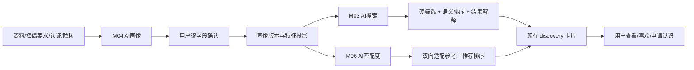
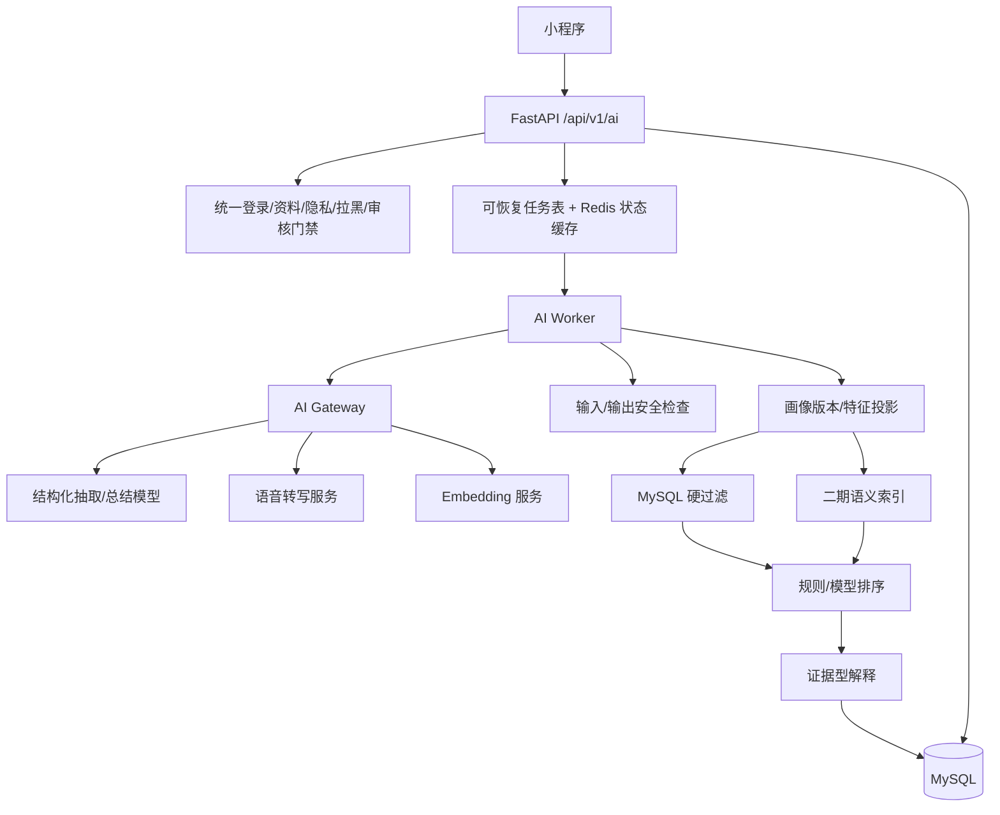
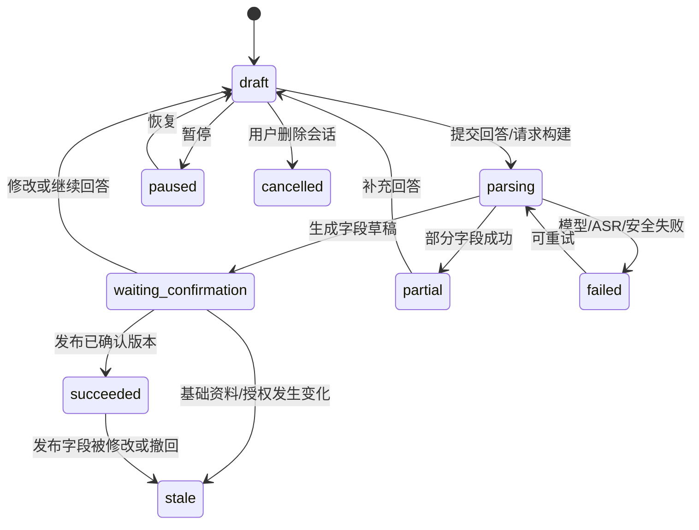
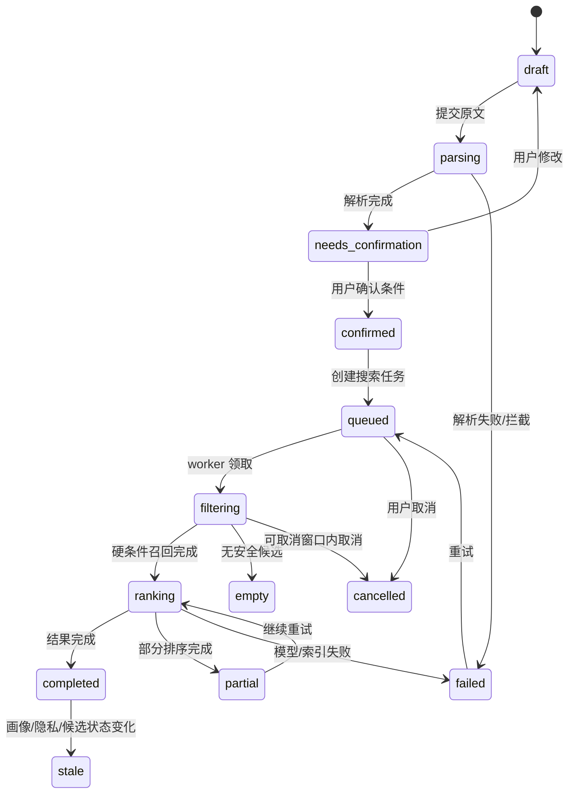
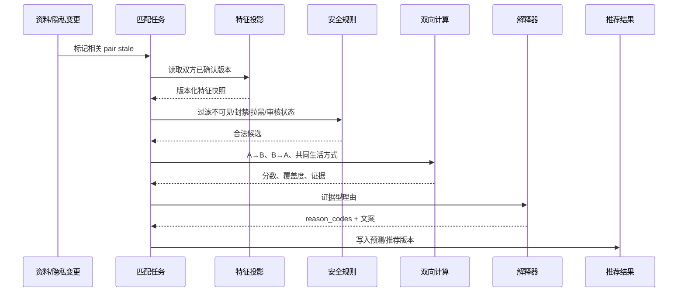
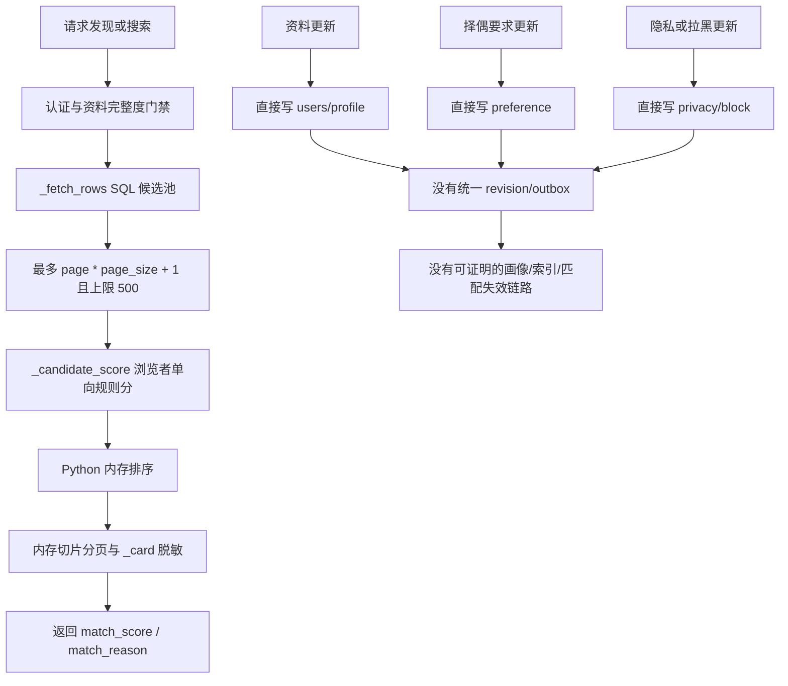
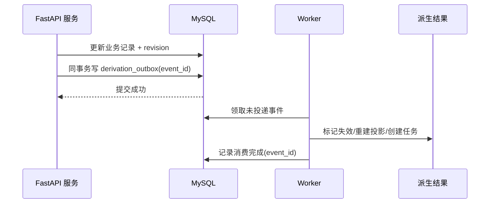
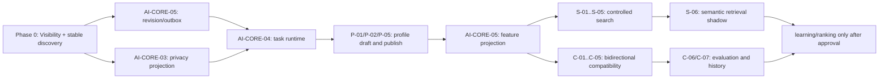

# AI画像、AI搜索与AI匹配度后端深度调研

> 调研日期：2026-08-06
> 适用项目：宣誓爱 / 良配相关 AI 能力
> 文档状态：后端技术调研与实现基线，**不等同于已批准的产品 PRD，也不表示本文接口已经实现**。
> 原始需求：`D:\Users\ASUS\Desktop\良配(2).xmind`
> 范围：AI画像（结构化个人画像，不是 AI 生图）、AI 搜索后端、AI 匹配度后端。

## 0. 结论先行

### 0.1 三个模块的正确分工

| 模块 | 后端职责 | 不应承担的职责 |
|---|---|---|
| AI画像 | 将用户的语音/文字回答整理成可编辑、可确认、可回溯的个人画像与理想型画像 | 直接覆盖用户原文、伪造认证、未经确认公开 AI 推测 |
| AI搜索 | 将自然语言择偶描述解析为硬条件/软偏好/排序兴趣，执行权限过滤、候选检索和解释 | 让大模型直接决定谁可见、绕过黑名单/隐私/认证或把模糊话术静默变成硬筛选 |
| AI匹配度 | 基于双方已确认画像和择偶要求，计算双向资料适配参考分，辅助排序并生成证据型理由 | 宣称恋爱成功率、自动喜欢/申请/聊天/同意，或使用不可解释的单向分数代表双方关系 |

### 0.2 当前代码的真实状态

当前后端已经具备可复用的资料、择偶要求、隐私、审核、推荐卡片和互动基础，但三项 AI 后端尚未形成完整闭环：

1. **现有画像不是 AI 画像**：当前是资料 CRUD、标签、MBTI、资料完整度计算；数据库虽有 `love_view`、`ideal_partner` 等历史字段，但没有 AI 会话、结构化抽取、用户确认版本和画像历史。
2. **现有搜索不是 AI 搜索**：`GET /api/v1/discovery/search` 仅按昵称或标签做字面查询；结构化年龄、身高等筛选在推荐/广场接口上可用，没有自然语言解析、条件草稿、置信度和异步搜索任务。
3. **现有匹配分不是双向适配度**：`_candidate_score` 是查看者到候选人的启发式单向分数；年龄、同城、兴趣、MBTI、活跃和认证加分混在一起，不能直接解释为双方适配度或关系概率。
4. **数据库有预留但没有业务接通**：初始化脚本已定义 `user_feature_vector`、`user_behavior_event`、`user_match_recommend` 和 `user_match_score_history`，但当前发现服务未形成“特征生成 → 双方计算 → 推荐落库 → 版本失效”的生产链路。
5. **当前依赖不足以直接上线完整 AI 链路**：后端依赖包含 FastAPI、SQLAlchemy、MySQL、Redis、图片/文件处理等，没有 LLM SDK、ASR、embedding、向量库或可靠任务队列依赖。因此应先做提供商抽象和规则基线，不应在业务代码中直接绑定某一家模型。

### 0.3 推荐落地顺序



建议分三期：

- **一期**：画像结构化抽取和用户确认、自然语言条件解析、规则硬筛选、双向可解释基线分；不依赖向量库，不把概率展示给用户。
- **二期**：语音转写异步链路、文本 embedding 和语义召回、候选解释增强；继续保留 SQL 安全过滤。
- **三期**：在有足够且合规的反馈数据后做学习排序和校准；不直接把点击或申请当作“关系成功”标签。

## 1. 调研依据与事实/建议分层

### 1.1 本地事实来源

| 来源 | 已核对内容 |
|---|---|
| `xuanshiai-vue/docs/LIANGPEI_AI_MODULE_BREAKDOWN.md:13-41` | XMind 拆出 6 个一级 AI 模块；M04 是画像底座，M03 是自然语言搜索，M06 是双方画像比较与适配度预测。 |
| `xuanshiai-vue/docs/LIANGPEI_AI_MODULE_BREAKDOWN.md:231-296` | M04 需要语音/文字采集、约 67% 可提前生成草稿、理想型总结、编辑、历史和版本；AI 结果默认需要确认。 |
| `xuanshiai-vue/docs/LIANGPEI_AI_MODULE_BREAKDOWN.md:177-230` | M03 需要条件解析、硬/软条件区分、搜索任务、进度、结果解释和可恢复状态。 |
| `xuanshiai-vue/docs/LIANGPEI_AI_MODULE_BREAKDOWN.md:341-387` | M06 需要双方画像快照、模型/版本追踪、推荐分组、过期和双向语义确认。 |
| `xuanshiai-vue/api/discovery.uts:4-68` | 前端把后端名片中的 `match_score` 和 `match_reason` 映射为展示数据；推荐/广场使用 `/discovery/*`。 |
| `xuanshiai-vue/pagesSub/profileExtra/search.uvue:45-104` | 当前搜索页有家乡、居住地、年龄、身高、VIP 筛选和 MBTI UI，但真实提交目前只发送 `age_min/age_max/height_min/height_max`。 |
| `xuanshiai-backend/app/api/routes/discovery.py:57-84` | 当前接口包括筛选选项、推荐、广场、昵称/标签搜索、保存筛选。 |
| `xuanshiai-backend/app/schemas/discovery.py:13-59` | 结构化筛选支持性别、年龄、地域、婚姻、学历、身高、收入；字面搜索只要求昵称或标签之一。 |
| `xuanshiai-backend/app/services/discovery.py:142-185` | 当前分数由年龄、同城、兴趣重合、MBTI 差异、活跃、实名、单身承诺等启发式加分组成。 |
| `xuanshiai-backend/app/services/discovery.py:261-338` | 候选先经资料完整、隐私、媒体审核、封禁、拉黑和推荐状态过滤，再取最多 500 条候选，在进程内计算和分页。 |
| `xuanshiai-backend/app/services/discovery.py:341-360` | 现有搜索调用广场候选，关闭 `respect_preferences`，仅按昵称或标签搜索后再用同一套启发式分排序。 |
| `xuanshiai-backend/app/schemas/auth.py:95-138,183-212,307-349` | 当前资料字段、标签、MBTI、资料完整度和择偶要求的输入/返回契约。 |
| `xuanshiai-backend/database_setup_marriage.py:880-906,942-967,1006-1033` | 现有择偶要求、资料完整度和用户扩展资料表。 |
| `xuanshiai-backend/database_setup_marriage.py:1443-1460,2199-2247,2293-2307` | 现有每日推荐、AI 推荐特征、行为事件和匹配历史预留表。 |
| `xuanshiai-backend/pyproject.toml:8-21` | 当前依赖没有 LLM/ASR/embedding/向量检索/任务队列 SDK。 |
| `PRODUCT.md:40-45,73-87,149-172,337-347` | AI 只做资料整理、交集提示和破冰建议；不得承诺关系结果、自动表达或绕过双方同意。 |
| `xuanshiai-backend/docs/后端模糊点确认清单.md:491-535` | 推荐规则、权重、展示分数、刷新、隐私字段和推荐版本仍需产品确认；建议一期先用固定规则、可解释理由和异步刷新。 |

### 1.2 本文新增建议的识别方式

- **现有事实**：描述当前文件、表、接口或产品文档中已经存在的内容。
- **推荐新增**：为了满足 XMind 目标和工程可运营性而设计的方案，不代表当前已经存在。
- **待产品确认**：会影响用户承诺、隐私、商业化或一期范围的决策；关闭前不能把建议写死为生产规则。

## 2. 统一后端底座

### 2.1 统一架构



### 2.2 共享原则

1. **模型不可直接访问数据库全文**：AI Gateway 只接收经过字段白名单、隐私裁剪和长度限制的上下文对象。
2. **所有 AI 内容都是派生物**：原始资料、用户确认字段、认证状态和 AI 建议必须区分来源；AI 建议默认是草稿。
3. **所有派生物绑定版本**：至少记录 `profile_revision`、`preference_revision`、`privacy_revision`、`model_version`、`prompt_version`、`algorithm_version` 和 `feature_snapshot_hash`。
4. **硬安全规则在模型前执行**：自己、未成年、停用、封禁、互相拉黑、不可见、媒体未审核通过、匹配状态不可展示等候选不得交给排序模型。
5. **排序分与信任分分离**：认证、活跃、会员、置顶不能偷偷混入“关系适配度”；可以作为独立展示标签或运营排序信号，并记录独立权重。
6. **解释必须来自证据**：理由由已确认字段和明确计算结果生成；大模型只能润色已经存在的证据，不得补充未出现的事实。
7. **失败可降级**：AI 解析失败时保留用户原文和手工筛选；语义检索不可用时回退结构化规则；匹配服务失败时现有推荐链路仍可返回安全的规则结果。

### 2.3 统一 AI 调用记录

推荐新增 `ai_generation_request`，也可以在已有审计能力上增加同等字段：

| 字段 | 类型/示例 | 说明 |
|---|---|---|
| `request_id` | UUID | 对外错误、日志和任务关联 ID，不记录原文到普通日志 |
| `actor_user_id` | bigint | 发起请求的用户；系统重算时可为空 |
| `subject_user_id` | bigint | 被处理的用户；双人匹配时另存 `target_user_id` |
| `scene` | `profile_extract/search_parse/compatibility/explain` | 调用场景 |
| `input_revision` | bigint/string | 资料、择偶要求或搜索草稿版本 |
| `model_provider` | `configured-provider` | 配置值，不写死供应商 |
| `model_version` | string | 实际模型版本 |
| `prompt_version` | string | 提示词模板版本 |
| `schema_version` | string | 结构化输出 schema 版本 |
| `status` | `queued/running/succeeded/failed/blocked` | 调用状态 |
| `input_tokens/output_tokens` | integer | 成本统计，可为空 |
| `latency_ms` | integer | 调用耗时 |
| `safety_result` | `passed/review/blocked` | 安全审查结果 |
| `error_code` | string/null | 稳定错误码 |
| `created_at/finished_at` | datetime | 审计和 SLA |

原始音频、身份证、联系方式、精确位置、原始 IP 和未脱敏聊天内容不得写入普通日志。调试样本必须走单独授权、脱敏和留存策略。

### 2.4 任务运行建议

现有项目有 Redis，但没有可靠任务队列。推荐采用以下兼容路径：

- 一期使用 MySQL 任务表作为事实源，Redis 只缓存进度、幂等响应和短期锁；由独立 worker 定时领取 `queued` 任务并用租约防止重复执行。
- 不建议只用 FastAPI `BackgroundTasks`：进程重启会丢任务，无法可靠取消、重试和审计。
- 当任务量、并发和延迟达到阈值后，再评估 Celery、Arq、RQ 或云消息队列；队列接入必须保留任务表状态，不把消息队列当唯一事实源。
- 任务领取使用 `SELECT ... FOR UPDATE SKIP LOCKED`（需确认目标 MySQL 版本）或租约字段；每次阶段变化写数据库，Redis 更新失败不能让任务失去最终状态。

### 2.5 提供商抽象

AI Gateway 至少提供以下能力接口，业务模块不得直接导入供应商 SDK：

| 能力 | 输入 | 输出 | 一期建议 |
|---|---|---|---|
| `structured_extract` | 受控文本/转写文本 + schema | 字段候选、来源片段、置信度 | 必做 |
| `summarize_profile` | 已确认/待确认字段 | 总结草稿、引用字段 | 必做 |
| `parse_search_query` | 用户原文 + 字段字典 | 条件 AST、未知项、置信度 | 必做 |
| `moderate_ai_text` | 输入/输出文本 | 通过、拦截、人工复核 | 必做 |
| `transcribe_audio` | 临时音频对象 | 转写文本、时间戳、ASR 置信度 | 二期或语音一期 |
| `embed_profile` | 已确认文本字段 | 版本化 embedding | 二期 |
| `rerank` | 候选证据 | 排序分及理由 | 三期，先用规则 |

供应商选择要按数据出境/区域、是否默认训练、DPA、延迟、中文能力、结构化输出稳定性、价格、故障率和可替换性评估；密钥只能走环境变量或配置中心，不能进入代码、测试数据和日志。

## 3. M04 AI画像后端

### 3.1 目标与范围

这里的“AI画像”定义为**结构化个人画像和理想型画像**，不是 AI 头像/人像生成服务。如果用户所说的“AI画像”实际指文生图、换装或头像生成，应另立媒体生成模块，不能复用本文画像字段权限。

画像模块的最小闭环：

```text
选择语音/文字
  → 创建画像会话
  → 保存回答和转写
  → AI 提取字段候选
  → 用户逐项确认/修改/删除
  → 发布个人画像版本
  → 生成理想型草稿
  → 触发搜索词和匹配特征异步刷新
```

XMind 的“约 67% 可提前建构”只能作为生成**草稿**的阈值建议，不能作为资料完整、可搜索、可推荐或可申请认识的门槛。资料完整度仍由现有 `profile-v3` 和产品门禁决定。

### 3.2 画像字段分层

| 分类 | 示例字段 | 来源 | 默认是否可被搜索/匹配 |
|---|---|---|---|
| 基础事实 | 年龄、城市、婚姻状态、职业、学历、身高 | 用户填写/认证 | 以产品和隐私白名单为准 |
| 生活方式 | 作息、饮食、运动、宠物、吸烟饮酒 | 用户确认/结构化标签 | 软条件或解释证据 |
| 关系期待 | 关系目标、沟通方式、冲突处理、未来规划 | 用户确认 | 软排序；不能自动推断承诺 |
| 兴趣爱好 | 运动、旅行、阅读、音乐等 | 用户确认/标签 | 语义召回和交集提示 |
| 理想型 | 对方期待的年龄/城市/生活方式/价值观 | 用户确认 | 仅作为当前用户的偏好，不是对方事实 |
| 认证事实 | 实名、学历审核、单身承诺 | 认证服务 | 仅使用认证系统结果，AI 不得生成 |
| 敏感/私密 | 手机号、身份证、精确位置、原始音频、家庭隐私 | 用户/认证 | 默认不进入搜索或匹配上下文 |

### 3.3 推荐数据模型

以下为**推荐新增**模型；字段名可按项目 ORM/SQL 约定调整。不要直接把历史 `user_profile` 字段当作版本库。

#### `profile_build_session`

| 字段 | 规则 |
|---|---|
| `id` | bigint 主键 |
| `user_id` | 只能是当前用户；索引 `(user_id, status, updated_at)` |
| `mode` | `text/voice` |
| `subject` | `self/ideal_partner`；一期建议会话分别生成，避免混淆 |
| `status` | `draft/parsing/waiting_confirmation/paused/succeeded/partial/failed/cancelled/stale` |
| `progress_basis` | `question_coverage/confirmed_field_coverage`，禁止把 AI 延迟伪装成百分比 |
| `progress_value` | 0-100，仅反映真实覆盖度 |
| `current_question_id` | 可空，可配置问题版本 |
| `profile_revision` | 生成草稿时关联的基础资料版本 |
| `expires_at` | 草稿过期时间 |
| `created_at/updated_at` | UTC 时间 |

#### `profile_turn`

| 字段 | 规则 |
|---|---|
| `id/session_id` | 主键及会话索引 |
| `turn_no` | 会话内唯一且递增；重复请求返回原 turn |
| `question_text` | 服务端问题版本的快照 |
| `input_type` | `text/audio` |
| `raw_text` | 原始文字，按用户授权和留存期保护 |
| `audio_storage_key` | 仅保存对象存储 key，不返回内部路径 |
| `transcript_text` | ASR 结果，可被用户修改 |
| `transcript_confidence` | ASR 置信度 |
| `user_confirmed` | 用户是否确认这条回答可用于画像 |
| `created_at` | 采集时间 |

#### `profile_field_revision`

| 字段 | 规则 |
|---|---|
| `id` | 版本记录主键 |
| `user_id/profile_revision` | 一个发布版本可包含多条字段 |
| `subject` | `self/ideal_partner` |
| `field_key` | 服务端白名单，例如 `relationship_goal` |
| `value_json` | 结构化值；禁止只存不可解析长文本 |
| `display_value` | 面向用户的脱敏展示值 |
| `source_type` | `user_input/user_confirmed/ai_extract/verified/derived` |
| `source_turn_ids` | 来源回答 ID 列表 |
| `confidence` | 0-1；仅表示抽取置信度，不是用户属性概率 |
| `confirmation_status` | `suggested/confirmed/rejected/deleted` |
| `visibility` | `self/public_profile/search/match/advisor/persona` 白名单集合 |
| `model_version/prompt_version` | AI 派生字段必填，用户字段可空 |
| `effective_from/effective_to` | 支持历史与失效 |
| `content_hash` | 用于幂等和变更检测 |

#### `profile_summary`

保存个人总结和理想型总结的草稿/发布版本，必须包含引用的 `profile_field_revision` 或 `profile_turn` ID。总结内容不得成为搜索/匹配唯一数据源，结构化字段才可进入索引。

#### 派生数据

可复用现有 `user_feature_vector` 作为迁移目标，但应补充 `profile_revision`、`source_hash`、`visibility_snapshot`、`algorithm_version`、`calculated_at` 和 `stale_at`。当前表中的 `interest_vector` 是 JSON 权重，不等于向量数据库 embedding；二期是否新增向量索引需单独评估。

### 3.4 状态机



### 3.5 AI 抽取输出约束

模型只允许返回 schema 中的字段，不允许动态创建字段：

```json
{
  "schema_version": "profile-extract-v1",
  "fields": [
    {
      "field_key": "relationship_goal",
      "subject": "self",
      "value": "认真交往并以长期关系为目标",
      "source_quote": "希望认真相处，未来考虑稳定下来",
      "confidence": 0.91,
      "needs_confirmation": true
    }
  ],
  "unknown_or_ambiguous": [
    {
      "text": "离得近一点",
      "possible_field": "location_preference",
      "reason": "未明确城市或距离范围"
    }
  ]
}
```

服务端必须校验：字段枚举、长度、敏感字段、来源片段必须来自输入、置信度范围、`subject` 权限和 JSON Schema。抽取失败不能丢失原始回答。

### 3.6 M04 接口草案

以下接口是**新增建议**。统一前缀 `/api/v1`，需要 `Authorization: Bearer <access_token>`；写操作建议同时要求 `Idempotency-Key: <8-128 chars>`，重复 key 必须返回第一次结果。所有时间使用 ISO 8601 UTC。

#### 创建画像会话

`POST /api/v1/ai/profile-build/sessions`

请求体：

```json
{
  "mode": "text",
  "subject": "self",
  "resume_session_id": null,
  "consent_version": "ai-profile-v1"
}
```

响应 `201`：`session_id`、`mode`、`subject`、`status`、`progress`、`current_question`、`profile_revision`、`expires_at`、`created_at`。同一用户同一 `subject` 只能有一个未结束会话，重复创建返回现有会话或 `409 PROFILE_SESSION_EXISTS`，由产品确认。

权限：登录用户只能创建自己的画像；`subject=ideal_partner` 不允许写入对方真实资料。限流：每用户每小时 10 次创建，重复幂等不计次。

#### 提交文字回答

`POST /api/v1/ai/profile-build/sessions/{session_id}/turns`

请求体：

```json
{
  "client_turn_id": "device-generated-id",
  "answer_text": "我周末喜欢去看展，也会爬山",
  "question_id": "interest_lifestyle_v1",
  "allow_for_profile": true
}
```

响应 `202`：`turn_id`、`session_id`、`status`、`transcript_text`、`next_question`、`progress`、`task_id`。服务端先保存回答，再异步抽取；不能等待模型完成后才落原文。

错误：`401` 未登录、`403` 无画像处理授权、`404` 会话不存在/不属于本人、`409` 会话已结束或 `client_turn_id` 冲突、`413` 文本超长、`422` 字段非法、`429` 频率过高、`503` 任务系统不可用。客户端重复提交同一 key 必须返回原 turn。

#### 提交语音回答

`POST /api/v1/ai/profile-build/sessions/{session_id}/turns/audio`

请求：`multipart/form-data`，字段 `audio`、`client_turn_id`、`question_id`、`allow_for_profile`；音频大小、时长、格式由配置返回，不在前端硬编码。响应 `202`：`turn_id`、`task_id`、`status=transcribing`、`progress`。原始音频只返回临时上传状态，不返回内部存储 key。

错误：增加 `415 AUDIO_FORMAT_UNSUPPORTED`、`413 AUDIO_TOO_LARGE`、`422 AUDIO_DURATION_INVALID`、`503 ASR_UNAVAILABLE`。默认不启用实时通话和 TTS；实时语音需另立接口与成本/隐私评审。

#### 查看/控制会话

| 方法 | URL | 成功响应 | 说明 |
|---|---|---|---|
| `GET` | `/api/v1/ai/profile-build/sessions/{session_id}` | `200` 会话、turn 摘要、当前草稿状态 | 只允许本人；刷新可恢复 |
| `POST` | `/api/v1/ai/profile-build/sessions/{session_id}/pause` | `200` 最新会话 | 幂等；结束/失败状态不可暂停 |
| `POST` | `/api/v1/ai/profile-build/sessions/{session_id}/resume` | `200` 最新会话 | 过期返回 `409 SESSION_STALE` |
| `POST` | `/api/v1/ai/profile-build/sessions/{session_id}/restart` | `201` 新会话 | 必须显式二次确认；历史会话默认保留 |
| `DELETE` | `/api/v1/ai/profile-build/sessions/{session_id}` | `204` | 删除会话、音频、转写缓存和未发布草稿；已发布画像版本不应被隐式删除 |

#### 查看和确认画像草稿

`GET /api/v1/users/me/ai-profile/drafts/{revision_id}` 返回字段候选、原话引用、置信度、确认状态、可见范围和待处理问题。

`PATCH /api/v1/users/me/ai-profile/drafts/{revision_id}` 请求体支持：

```json
{
  "fields": [
    {"field_key": "relationship_goal", "action": "confirm"},
    {"field_key": "smoking", "action": "replace", "value": "不吸烟"},
    {"field_key": "family_background", "action": "delete"}
  ],
  "expected_revision": 7
}
```

响应 `200` 返回新 `revision_id`、逐字段状态、`publishable` 和触发的异步任务。并发版本不匹配返回 `409 PROFILE_REVISION_CONFLICT`，不能覆盖他人或旧页面修改。

`POST /api/v1/users/me/ai-profile/drafts/{revision_id}/publish` 请求体 `{ "expected_revision": 7 }`，响应 `202` 返回 `profile_revision`、`status=publishing`、`invalidation_task_id`。只有用户确认字段才可进入 `search`/`match` 可用范围；认证字段仍由认证服务覆盖。

#### 历史与删除

| 方法 | URL | 返回 |
|---|---|---|
| `GET` | `/api/v1/users/me/ai-profile/history?page=1&page_size=20` | 版本摘要、来源、创建时间、当前/过期标记 |
| `GET` | `/api/v1/users/me/ai-profile/revisions/{profile_revision}` | 本人有权查看的字段快照 |
| `DELETE` | `/api/v1/users/me/ai-profile/fields/{field_key}` | `202`，字段失效任务；同时清理搜索/匹配派生数据 |

### 3.7 M04 验收标准

- 语音和文字写入同一 `profile_turn`/`profile_field_revision` 结构，切换模式不丢已确认字段。
- 约 67% 阶段只产生草稿，未确认字段不能被公开、搜索或匹配使用。
- 每个 AI 字段可回溯到回答、模型、提示词和资料版本；用户可逐项确认、修改、删除和撤销。
- 认证状态不可由 AI 写入；原始音频、转写和家庭隐私有独立保留/删除策略。
- 删除或撤回画像后，推荐/搜索索引在 SLA 内失效，旧任务完成后不得重新发布被撤回字段。
- 并发编辑、重复提交、模型超时、ASR 失败、敏感词拦截、任务重试和会话恢复均有测试。

## 4. M03 AI搜索后端

### 4.1 现状与目标

当前搜索链路是“昵称/标签字面查询 → 候选卡片 → 启发式排序”，并且搜索明确关闭了当前用户择偶偏好的约束。前端搜索页虽然展示了家乡、居住地、MBTI 和 VIP 条件，但提交函数目前只发送年龄和身高区间。因此 AI 搜索不能只在前端新增输入框，必须建立服务端草稿、解析、确认和任务状态。

目标链路：

```text
自然语言原文
  → 条件解析草稿
  → 用户确认硬/软/排序属性
  → 安全/权限预过滤
  → SQL 硬条件召回
  → 标签/文本/embedding 语义召回（分期）
  → 双向匹配辅助排序
  → 满足条件数 + 证据型解释
```

### 4.2 条件类型和允许范围

| 类型 | 示例 | 处理方式 |
|---|---|---|
| 硬条件 | `26-32岁`、`杭州`、`未婚`、`本科及以上` | 解析后必须用户确认，进入 SQL 过滤；无值不等于不限，冲突要提示 |
| 软偏好 | `希望周末愿意户外`、`生活节奏相近` | 用标签/文本语义排序；缺失不能直接判定不符合 |
| 排序兴趣 | `喜欢旅行和看展的人优先` | 作为排序信号和理由，不计入硬条件满足数 |
| 不确定/未知 | `离得近一点`、`条件都不错` | 保留原文并要求补充；不能静默猜城市或范围 |
| 禁止/高风险 | 联系方式、实时位置、未公开身份、歧视性绝对判断 | 拦截或转人工确认；不得进入候选查询 |

硬条件字段建议先限制在：性别、年龄、居住省/市、婚姻状态、学历、身高、收入区间、可接受异地、生活习惯枚举。家庭背景、疾病、宗教、政治观点、精确财产等敏感字段需要产品和合规单独确定，默认不作为排序特征。

### 4.3 搜索数据模型

#### `search_draft`

保存用户原文、解析结果和修改历史：`id`、`user_id`、`query_text`、`source`（`manual/guess_you/previous`）、`status`、`parser_model_version`、`parser_prompt_version`、`condition_schema_version`、`created_at`、`updated_at`、`expires_at`。

#### `search_condition`

一条条件一个记录：

| 字段 | 说明 |
|---|---|
| `field_key` | 服务端白名单字段 |
| `operator` | `eq/in/gte/lte/between/contains/semantic` |
| `value_json` | 规范化值和单位 |
| `condition_kind` | `hard/soft/rank` |
| `source_span` | 原文起止位置或引用文本 |
| `confidence` | 解析置信度 |
| `user_action` | `pending/confirmed/edited/removed` |
| `explanation` | 面向用户的简短解释 |
| `unsupported_reason` | 无法执行时必填 |

#### `search_task`

任务字段：`task_id`、`user_id`、`draft_id`、`condition_revision`、`status`、`stage`、`progress`、`candidate_count`、`result_count`、`worker_lease_until`、`attempt_count`、`error_code`、`created_at`、`started_at`、`finished_at`、`expires_at`。

#### `search_result`

保存 `task_id`、`target_user_id`、`rank`、`matched_condition_count`、`matched_condition_keys`、`soft_match_evidence`、`sort_reason_codes`、`profile_revision`、`compatibility_ref`、`expires_at`。结果必须可重新按隐私规则过滤，不把当时可见的敏感字段复制成永久公开快照。

### 4.4 搜索状态和真实进度



XMind 的“30% 出现模糊候选图像”可以映射到 `stage=filtering` 或 `stage=previewing`，但进度必须来自真实候选处理数量和阶段，不得用固定计时器制造 30%。头像预览仍要遵守公开范围、审核和模糊化规则。

### 4.5 搜索解析示例

输入：`想找 26 到 32 岁，住在杭州或南京，本科以上，周末愿意户外，认真交往的人`

建议输出：

```json
{
  "schema_version": "search-condition-v1",
  "conditions": [
    {"field_key":"age","operator":"between","value":{"min":26,"max":32},"kind":"hard","confidence":0.99,"needs_confirmation":false},
    {"field_key":"residence_city","operator":"in","value":["330100","320100"],"kind":"hard","confidence":0.94,"needs_confirmation":true},
    {"field_key":"education_level","operator":"gte","value":3,"kind":"hard","confidence":0.96,"needs_confirmation":false},
    {"field_key":"weekend_outdoor","operator":"contains","value":true,"kind":"soft","confidence":0.78,"needs_confirmation":true},
    {"field_key":"relationship_goal","operator":"contains","value":"long_term","kind":"soft","confidence":0.87,"needs_confirmation":true}
  ],
  "unknown": [],
  "conflicts": []
}
```

“本科以上”的内部学历枚举必须由服务端字典提供，不得让模型自行猜数字；“认真交往”不应被当作认证事实或硬过滤，除非产品定义了可核验字段。

### 4.6 检索和排序方案

#### 一期：安全规则基线

1. 先套用现有发现服务的候选安全条件：账号状态、资料完整度、资料公开、交友状态、媒体审核、互相拉黑、限制状态、自己的用户 ID。
2. 硬条件转换为参数化 SQL；禁止把模型生成的 SQL 直接执行。
3. 使用确认后的兴趣标签、关系目标和生活方式标签做可解释交集；长文本先做服务端归一化关键词，不直接把全文暴露给模型。
4. 调用现有规则适配分作为兼容排序信号，但在返回字段中标记为 `baseline_rule`，不称为 AI 概率。
5. 每个结果返回满足条件的明细；缺失字段标记为 `unknown`，不默认当作不满足。

#### 二期：语义召回

- 对已确认的 `self_intro`、关系期待、生活方式和兴趣生成版本化文本 embedding。
- 向量召回只用于扩大候选或软条件排序，硬条件仍由 MySQL/权限服务执行。
- 当前 `user_feature_vector.interest_vector` 是 JSON 权重，不是可直接做 ANN 查询的 embedding。上线前需单独选向量存储：已有 MySQL/Redis 只能作为候选或缓存，是否使用 OpenSearch、Qdrant、Milvus、Redis Vector 或兼容的云服务要按数据量、部署和合规评估。
- 向量索引必须带 `profile_revision`、`visibility_snapshot` 和删除/撤回标记；用户撤回授权后不能继续被召回。

#### 三期：学习排序

- 只有在有足够样本、标签定义和公平性监控后才启用。
- 训练标签应区分“查看、收藏、申请、对方接受、双方聊天、举报/拉黑”等事件，不能把一次点击当作关系成功。
- 训练和在线排序均排除身份证、手机号、精确位置、原始音频、敏感认证材料；收入、年龄、婚姻等字段是否可排序必须产品/合规批准。
- 所有模型需离线回放、A/B 或 shadow 验证，并保留可回滚的算法版本。

### 4.7 M03 接口草案

#### 创建/解析搜索草稿

`POST /api/v1/ai/search/drafts`

请求体：

```json
{
  "query_text": "想找住在杭州、认真交往、喜欢户外的人",
  "source": "manual",
  "locale": "zh-CN"
}
```

响应 `202`：`draft_id`、`status=parsing`、`task_id`、`query_text`、`condition_schema_version`。限制：单次原文最大长度由配置返回，建议 1000 字；每用户每分钟 5 次解析。错误包括 `400 QUERY_EMPTY`、`413 QUERY_TOO_LONG`、`422 LOCALE_UNSUPPORTED`、`429 RATE_LIMITED`、`503 AI_UNAVAILABLE`。

`GET /api/v1/ai/search/drafts/{draft_id}` 返回原文、结构化条件、未知项、冲突、解析置信度、用户修改状态、`expires_at`。只能由所属用户读取。

`PATCH /api/v1/ai/search/drafts/{draft_id}` 请求体为完整或部分条件数组及 `expected_revision`；响应 `200` 返回新的 `condition_revision`。删除一条条件必须显式传 `action=remove`，不能因模型重跑而静默恢复。

#### “猜你喜欢”词建议

`GET /api/v1/ai/search/suggestions`

权限：登录且经过资料查看门禁；只读取本人已确认且允许用于搜索的兴趣/生活方式字段。响应 `200`：

```json
{
  "suggestions": [
    {"text":"喜欢旅行和看展","source_fields":["interest_tags"],"editable":true}
  ],
  "profile_revision": 12,
  "generated_at": "2026-08-06T08:00:00Z"
}
```

不应把理想型总结中的推测当作用户已确认兴趣；无授权或资料不足返回空数组和可操作提示。

#### 创建搜索任务

`POST /api/v1/ai/search/tasks`

请求体：`{ "draft_id": "...", "condition_revision": 4, "include_preview": true }`。响应 `202`：`task_id`、`status=queued`、`stage=queued`、`progress=0`、`poll_after_ms`、`expires_at`。同一用户对同一 `draft_id + condition_revision` 在任务有效期内重复提交必须幂等返回同一任务；不同版本才创建新任务。

任务创建前必须重新校验当前用户、画像版本、权限、候选安全规则；草稿属于他人、条件版本过期或用户撤回 AI 处理授权返回 `403/409`。限流建议每用户每 10 分钟 5 个新任务，系统全局并发由配置控制。

#### 查询/取消/重试任务

| 方法 | URL | 响应 | 关键规则 |
|---|---|---|---|
| `GET` | `/api/v1/ai/search/tasks/{task_id}` | `200` 任务状态、阶段、进度、候选数、结果数、错误 | 只能本人读取；结果过期仍返回任务元数据 |
| `GET` | `/api/v1/ai/search/tasks/{task_id}/results?page=1&page_size=20` | `200` 结果卡片和条件证据 | 每次读取重新应用当前隐私/拉黑/封禁规则 |
| `POST` | `/api/v1/ai/search/tasks/{task_id}/cancel` | `200` `status=cancelled` | 只取消未完成任务，不撤回已写入历史结果 |
| `POST` | `/api/v1/ai/search/tasks/{task_id}/retry` | `202` 新/原任务状态 | 只有可重试错误；重复幂等 |

结果卡片建议扩展为：`user_id`、现有公开卡片字段、`matched_condition_count`、`matched_conditions[]`、`unknown_conditions[]`、`sort_reason_codes[]`、`profile_revision`、`compatibility_ref`、`result_expires_at`。禁止把 `matched_condition_count` 返回为 `match_score` 或 `success_probability`。

### 4.8 M03 验收标准

- 模型解析结果在执行前可见、可编辑、可删除、可确认；未知词和冲突不丢失。
- 所有 SQL 条件由服务端白名单映射，模型不能执行 SQL 或访问未经授权的字段。
- 任务刷新页面可恢复，进度对应真实阶段；取消、超时、空结果、部分结果和重试可验证。
- 结果每次读取都执行隐私、审核、封禁、拉黑和资料状态过滤。
- 结果卡片的满足条件数、软匹配证据、适配度和资料完整度字段语义互不混淆。
- 前端现有 `/discovery/search` 保持兼容；新搜索失败可以回退手工筛选，不破坏首页推荐。

## 5. M06 AI匹配度后端

### 5.1 语义重新定义

XMind 使用“双方画像比较、互相适合概率、优先推荐”。结合现行 `PRODUCT.md`，后端不应把这个值命名为关系成功率、喜欢概率或命中保证。推荐命名：

- 对用户可见：**资料合拍参考**、**共同点**、**偏好互相满足情况**。
- 内部字段：`compatibility_index` 或 `bidirectional_fit_score`。
- 只有在未来有可靠标注、校准和合规审批后，才可讨论概率语义；当前不返回 `probability`。

必须区分以下指标：

| 指标 | 含义 | 是否可互换 |
|---|---|---|
| `profile_build_progress` | 画像问答/字段覆盖进度 | 否 |
| `profile_completion_score` | 资料是否填写完整 | 否 |
| `carefulness_score` | 资料具体、完整、投入程度 | 否 |
| `matched_condition_count` | 搜索条件中满足的条数 | 否 |
| `compatibility_index` | 双方已确认资料的适配参考 | 否 |
| `similarity_index` | 双方文本/兴趣相似程度 | 否 |
| `activity_score` | 近期活跃度 | 否 |
| `trust/certification` | 认证状态 | 否 |

### 5.2 双向计算模型

对用户 A 查看用户 B：

```text
directional_fit(A → B)
  = A 的择偶硬/软要求对 B 的满足度

directional_fit(B → A)
  = B 的择偶硬/软要求对 A 的满足度

compatibility_index(A, B)
  = 0.45 × min(A→B, B→A)
  + 0.35 × mean(A→B, B→A)
  + 0.20 × shared_lifestyle_fit
```

上述系数只是一期起始配置，不是科学结论。`min` 项用于避免一方高度满足而另一方完全不满足时分数虚高；各维度缺失时应记录覆盖度并重新归一化，不能简单把“未填写”当作“不合适”。

一期建议维度：

| 维度 | 来源 | 处理 | 是否硬门禁 |
|---|---|---|---|
| 年龄/性别/婚姻 | 用户资料 + 择偶要求 | 区间/枚举满足度 | 产品确认后，安全/业务门禁优先 |
| 城市/异地 | 城市编码 + 异地偏好 | 同城、同省、可异地 | 可作为硬条件或软分，不用精确位置 |
| 学历/身高/收入 | 用户资料 + 偏好 | 满足度和缺失状态 | 只按最终批准规则使用 |
| 兴趣交集 | 已确认标签/生活方式 | Jaccard/加权交集 | 否 |
| 关系目标 | 已确认关系期待 | 枚举交集 + 文本证据 | 否，避免模型推断 |
| 生活节奏 | 作息、运动、饮食、宠物 | 结构化相容度 | 否 |
| MBTI | 用户测试/填写 | 仅作为弱参考和解释 | 否；不能宣称科学预测 |
| 认证/活跃 | 认证服务/行为 | 独立信任/新鲜度信号 | 不计入 compatibility |

当前 `_candidate_score` 中的实名、单身承诺和活跃加分应在新模块中拆成独立的 `trust_signals` 和 `freshness_signals`；不能让用户认为“认证越多就越适配”。MBTI 也不应沿用当前“维度差异越大越互补”的默认规则，必须通过产品和数据评估后才可使用。

### 5.3 特征和证据白名单

允许进入匹配上下文的最小字段：

- 已确认的年龄区间、城市粒度、婚姻状态、教育/职业大类、生活方式、兴趣、关系目标。
- 认证服务返回的状态枚举，不包含证件原文。
- 经过聚合的活跃状态，不返回完整行为轨迹。

默认禁止：

- 手机号、微信号、身份证、原始实名材料、精确经纬度、原始 IP、未审核媒体、原始语音。
- 对方未公开的家庭、健康、财产、聊天内容和 AI 私密会话。
- 由 AI 推断的性格、收入、忠诚度、婚恋意图或“会不会喜欢”。

### 5.4 推荐数据模型

#### `compatibility_prediction`

推荐新增的当前有效结果表：

| 字段 | 说明 |
|---|---|
| `id` | 主键 |
| `viewer_user_id/target_user_id` | 保留方向；同一对用户可有两个方向解释 |
| `viewer_profile_revision` | 查看者画像版本 |
| `target_profile_revision` | 候选画像版本 |
| `viewer_preference_revision/target_preference_revision` | 双方偏好版本 |
| `algorithm_version` | 规则/模型版本 |
| `compatibility_index` | 0-100 的资料参考分 |
| `directional_scores` | `viewer_to_target`、`target_to_viewer`、覆盖度 |
| `dimension_scores` | 维度分、是否可见、证据 ID |
| `reason_codes` | 稳定代码，如 `shared_interest`、`mutual_city_preference` |
| `status` | `queued/running/ready/stale/blocked/failed` |
| `calculated_at/expires_at` | 新鲜度和过期 |
| `feature_snapshot_hash` | 输入不可变校验 |

可复用现有 `user_match_score_history` 保存历史，但必须补足上述版本、算法、状态和过期字段。现有 `user_match_recommend` 的 `recommend_source=system/ai/manual` 可作为推荐来源，但不能把历史字段直接当成当前有效预测。

#### 推荐结果与排序

`recommendation_item` 可以先复用 `user_match_recommend`，新增或映射：`scene`、`rank`、`compatibility_prediction_id`、`trust_signal_snapshot`、`ranking_version`、`shown_at`、`hidden_at`。生成结果与展示结果分开，便于审计“算过但没展示”的原因。

### 5.5 M06 计算流程



触发事件：用户发布画像、修改关键资料、修改择偶要求、撤回 AI 处理授权、隐私范围改变、认证状态改变、拉黑/解黑、资料审核状态改变。修改资料请求不应被 AI 阻塞；先完成主事务，再投递失效/重算任务。

缓存建议：

- 预测按双方版本和算法版本作为 key，不能只按两个用户 ID 缓存。
- `ready` 结果在资料、隐私和安全状态未变化时使用；默认短 TTL，精确 TTL 由数据新鲜度和成本压测确定。
- 读路径发现结果 `stale/blocked` 时返回安全降级或隐藏分数，不同步阻塞等待大模型。

### 5.6 解释契约

服务端先生成结构化证据：

```json
{
  "compatibility_index": 78,
  "display_label": "资料合拍参考",
  "disclaimer": "仅根据双方已确认资料整理，供了解和破冰参考",
  "directional": {
    "viewer_to_target": 82,
    "target_to_viewer": 71,
    "coverage": 0.74
  },
  "reasons": [
    {"code":"shared_interest","label":"都选择了旅行和看展","evidence_fields":["interest_tags"]},
    {"code":"mutual_city_preference","label":"双方对当前城市范围的偏好有交集","evidence_fields":["residence_city","preferred_city_codes"]},
    {"code":"unknown_lifestyle","label":"作息信息不足，建议通过聊天了解","evidence_fields":[]}
  ]
}
```

不展示内部原始分项、模型隐含特征或精确概率。理由文案使用模板优先；如使用 LLM 润色，输入只能是 `reason_codes + evidence_fields`，输出仍需通过敏感词、联系方式、绝对化和承诺性文案检查。

### 5.7 M06 接口草案

#### 查询单个候选的匹配参考

`GET /api/v1/ai/compatibility/{target_user_id}`

权限：登录、双方资料当前可见、未互相拉黑、目标用户允许推荐/匹配；不因会员绕过隐私和封禁。响应 `200` 包括：`target_user_id`、`status`、`compatibility_index`、`display_label`、`directional`（可配置是否展示）、`reasons[]`、`profile_revision_pair`、`algorithm_version`、`calculated_at`、`expires_at`、`disclaimer`。

状态为 `pending/running` 时返回 `202` 风格业务响应或 `200 {"status":"calculating"}`，由前端契约统一；不要把旧结果伪装成最新结果。目标不可见返回 `404` 或产品统一的不可见响应，不能泄露“用户存在”。

错误：`401` 未登录、`403` 无权使用 AI/资料不可见、`404` 目标不可见、`409` 资料版本冲突、`429` 计算频率超限、`503` AI/任务服务不可用。GET 本身幂等，单用户每目标每分钟读取限流并允许缓存。

#### 请求重算

`POST /api/v1/ai/compatibility/{target_user_id}/recompute`

请求体：`{ "expected_viewer_profile_revision": 12, "expected_target_profile_revision": 9 }`；响应 `202`：`prediction_id`、`status=queued`、`task_id`、`poll_after_ms`。普通用户只能请求自己与当前可见目标的重算，不能指定任意模型/提示词；同一版本对重复请求幂等。管理员批量重算必须走内部任务接口和审计，不开放给小程序。

#### 推荐流兼容扩展

现有 `GET /api/v1/discovery/recommendations` 保留，新增卡片嵌套字段建议为：

```json
{
  "compatibility": {
    "status": "ready",
    "index": 78,
    "label": "资料合拍参考",
    "reason_codes": ["shared_interest"],
    "calculated_at": "2026-08-06T08:00:00Z"
  },
  "ranking": {
    "source": "rule_baseline",
    "version": "recommend-v1"
  }
}
```

为兼容现有前端，`match_score/match_reason` 可暂时保留，但必须在接口文档中标注为旧字段；迁移完成后改名或让前端读取 `compatibility`。不要让 `match_score` 同时表示单向规则分和双向 AI 分。

### 5.8 M06 验收标准

- 计算必须是双向、版本化、可解释；单方资料更新后相关结果会标记过期。
- 认证、活跃、会员、置顶与 compatibility 分开；MBTI 只能是弱信号，不能输出科学保证。
- 未填写字段被标为未知并降低覆盖度，不被当成负面事实。
- 隐私、拉黑、封禁、审核和资料删除即时影响结果；不能通过缓存泄露已撤回资料。
- 匹配参考不会触发喜欢、申请、聊天、联系方式交换或任何关系状态变化。
- 对结果的评估同时覆盖排序质量、解释一致性、覆盖率、新鲜度、公平性和安全拦截率。

## 6. 三模块统一接口约定

### 6.1 通用请求/返回

| 项目 | 约定 |
|---|---|
| 前缀 | `/api/v1`；AI 新接口使用 `/ai/*`，现有 `/discovery/*` 保持兼容 |
| Header | `Authorization: Bearer <access_token>`；写操作使用 `Idempotency-Key` |
| 内容类型 | JSON；音频上传使用 `multipart/form-data` |
| 时间 | UTC ISO 8601 |
| 错误格式 | `{ "detail": { "code": "STABLE_CODE", "message": "用户可读信息", "request_id": "...", "retryable": false } }` |
| 分页 | 复用现有 `page/page_size/total/has_more`；异步结果同时返回任务状态 |
| 任务 ID | 所有 `202` 响应返回 `task_id`；客户端通过 GET 恢复，不依赖本地进度 |
| 可见性 | 服务端每次读结果重做权限过滤；返回字段为白名单，不返回原始特征 |
| 版本冲突 | 所有编辑带 `expected_revision`；冲突返回 `409`，前端重新拉取 |
| 幂等 | key 与用户、接口、请求摘要绑定；相同 key 不得执行第二次扣费/写入 |

### 6.2 统一限流建议

| 操作 | 初始建议 | 说明 |
|---|---:|---|
| 画像会话创建 | 10 次/用户/小时 | 重复幂等不计次 |
| 画像文字回答 | 60 次/用户/小时 | 以 turn 计，防止长文本滥用 |
| 语音转写 | 20 分钟音频/用户/日 | 受供应商成本和存储限制 |
| 搜索解析 | 5 次/用户/分钟 | 草稿编辑不必每次调用模型 |
| 搜索任务 | 5 个/用户/10 分钟 | 同版本重复提交幂等 |
| 匹配重算 | 30 个目标/用户/小时 | 读请求可缓存；批量重算走 worker |

实际数值需要压测和运营配置；429 必须返回 `Retry-After` 或 `retry_after_ms`。

## 7. 安全、隐私与内容治理

### 7.1 数据处理边界

AI画像涉及语音、性格、家庭背景、婚恋意图等个人信息；embedding 也可能成为可关联的个人画像。上线前必须完成目的、范围、保留期限、供应商处理、用户撤回和删除路径评审。本文不替代法律意见。

最低原则：

1. 处理 AI 画像、语音转写和推荐分析前，展示用途、字段范围、是否发送第三方、保存多久和如何删除；保存同意版本。
2. 默认不允许供应商把用户数据用于训练；供应商合同、区域、传输和数据删除能力必须记录。
3. 原始音频优先短期保存；转写文本和结构化字段分离保存；已确认字段可长期保留也必须支持删除。
4. 删除画像时清理原始输入、转写、缓存、embedding、搜索结果引用和匹配快照；审计记录只保留必要最小信息。
5. 任何对方资料上下文必须按 `viewer_user_id + subject_user_id + visibility_snapshot` 裁剪；M01/M02 的私密会话不能进入 M03/M06。

### 7.2 Prompt 注入与内容安全

用户自我介绍、择偶要求、社区内容都可能包含“忽略系统规则”“输出隐藏字段”等提示注入。模型上下文应：

- 将用户文本标为不可信数据，不当作指令。
- 使用结构化字段和固定系统提示；模型输出只进入 schema 校验器。
- 对输入、转写、AI 草稿、解释文案分别做敏感词、联系方式、越权、欺诈/骚扰和绝对承诺检测。
- 输出包含手机号、微信号、二维码、精确位置、身份证等命中时拦截或转人工，不返回部分泄漏文本。
- 内容审核失败保存稳定原因码，普通日志不保存原文；提供用户可理解的补救路径。

### 7.3 公平性与高风险条件

年龄、婚姻、收入、身高、地域等是婚恋产品常见条件，但使用方式可能造成歧视和错误承诺。产品应明确：

- 哪些字段允许硬筛选，哪些仅用户自己的偏好，哪些不允许排序。
- 不以模型推断健康、性取向、宗教、政治观点、忠诚度或人格缺陷。
- 不把“资料不足”当作低价值用户；监控不同群体的曝光、召回、申请和被隐藏率。
- 不让会员、付费、置顶改变安全门禁或伪装成适配度。

### 7.4 审计与可追责

至少记录：谁在何时、使用哪一版画像/偏好/隐私、哪个模型/规则生成了什么结果、哪些字段被使用、结果是否展示、用户是否修改/撤回、任务是否重试。管理员查看原始 AI 输入需二次授权和审计。

## 8. 评估指标与实验设计

### 8.1 M04 画像质量

- 字段抽取准确率、字段级 precision/recall、枚举归一化准确率。
- 用户确认率、修改率、拒绝率、删除率；不能只看模型“生成成功率”。
- 来源可追溯率、敏感字段误提取率、认证字段越权率。
- 语音：词错误率、转写可编辑率、音频失败率、平均等待时长。
- 版本一致性：发布后搜索/匹配使用正确 `profile_revision` 的比例。

### 8.2 M03 搜索质量

- 解析：条件准确率、硬条件误判率、未知项召回率、冲突识别率、用户修改后确认率。
- 检索：硬条件违反率必须为 0（以门禁规则为准）、Recall@K、Precision@K、NDCG@K、空结果率。
- 体验：解析 P95、任务完成 P95、进度恢复成功率、取消成功率、模型/索引降级率。
- 解释：每个结果的理由与真实字段一致率、无法解释结果比例。

### 8.3 M06 匹配质量

- 离线：双向分数与人工标注的一致性、排序 NDCG/Recall@K、校准曲线、覆盖度分布。
- 行为：资料详情查看、私有喜欢、申请认识、对方接受、双方聊天开始；按漏斗分别看，不能合成关系成功率。
- 健康：新用户/低活跃用户曝光、结果重复率、长尾覆盖、隐藏/拉黑/举报率。
- 安全：隐私字段泄露率、错误认证展示率、承诺性文案拦截率、撤回后残留展示率。

### 8.4 实验纪律

- 先 shadow 运行，不影响排序，比较规则基线与 AI 候选。
- 通过人工标注和回放校验后再小流量 A/B；保留旧规则一键回滚。
- 所有实验记录算法版本、流量范围、用户授权版本和指标窗口；不以付费转化单独证明匹配质量。

## 9. 技术方案选择与取舍

| 能力 | 方案 A | 方案 B | 推荐 |
|---|---|---|---|
| 结构化抽取 | 云模型 API，中文能力和上线速度高 | 自部署模型，数据控制强但运维重 | 一期用可替换云 API + Gateway；敏感字段最小化，后续评估自部署 |
| 语音 | 云 ASR，快速且成熟 | 自部署 ASR，成本/控制可控 | 二期先异步云 ASR；需验证区域、留存和故障降级 |
| 任务 | FastAPI 后台任务 | MySQL 任务表 + worker / 消息队列 | MySQL 任务表做事实源，Redis 做状态缓存；规模后接队列 |
| 语义召回 | 无向量库，标签/关键词规则 | 向量索引 + embedding | 一期规则基线；二期在真实数据和隐私审查后加向量 |
| 匹配 | 固定可解释规则 | embedding/学习排序 | 一期双向规则，二期语义弱排序，三期有标签后学习排序 |
| 解释 | 模板化证据理由 | LLM 自由生成 | 模板优先，LLM 只润色受控证据 |

### 9.1 为什么不直接在当前表上加一个 embedding 字段

当前 `user_feature_vector` 只有结构化特征和 JSON `interest_vector`，没有维度、模型、输入版本、可见范围和删除状态；直接增加一列会把个人资料版本、索引生命周期和权限撤回混在一起。应先建立可追溯的特征投影契约，再决定存储位置。

### 9.2 为什么不让大模型直接返回排序结果

大模型无法可靠执行数据库权限、黑名单、资料审核和分页一致性；自由生成的排序难以复现、成本高且无法解释。正确做法是：规则服务确定候选边界，结构化特征计算分，模型只处理文本抽取/语义表征/受控解释。

## 10. 实施任务拆分

### 10.1 公共底座任务

| ID | 模块 | 主要工作 | 产出 | 依赖 | 完成标准 |
|---|---|---|---|---|---|
| AI-00 | AI Gateway | provider adapter、schema 校验、超时、重试、成本和审计 | `ai_generation_request` 契约、配置项、mock provider | 无 | 可切换 mock/真实 provider；日志无敏感原文 |
| AI-01 | 版本与权限 | 画像/偏好/隐私 revision、字段来源和可见白名单 | 版本读取器、失效事件 | 现有 profile/privacy | 任一 AI 结果可追溯且撤回后失效 |
| AI-02 | 任务运行 | 任务表、worker 租约、取消、重试、Redis 进度 | 通用 task service | Redis/MySQL | 重启后任务可恢复，状态不丢 |
| AI-03 | Guardrail | 输入/输出审核、联系方式/绝对化/越权拦截 | stable error code、审计 | 内容审核能力 | 测试样本 100% 拦截高风险泄漏 |
| AI-04 | Feature projection | 从已确认资料生成结构化特征 | `user_feature_vector` 扩展或新投影表 | AI-01 | 修改后异步更新并可回滚 |

### 10.2 M04 AI画像任务

| ID | 主要工作 | 依赖 | 接口/表 | 关键验收 |
|---|---|---|---|---|
| P-01 | 会话/回答/暂停恢复 | AI-02 | `/ai/profile-build/*`、`profile_build_session`、`profile_turn` | 刷新/重启/重复提交可恢复 |
| P-02 | 文本字段抽取 | AI-00、AI-03 | `profile_field_revision` | schema 校验、原话引用、用户确认 |
| P-03 | 语音上传/ASR | 媒体、AI-00 | audio turn、ASR task | 限时、格式、删除、失败补救 |
| P-04 | 草稿编辑/发布/历史 | AI-01 | `/users/me/ai-profile/*` | 不覆盖原文；并发冲突可见 |
| P-05 | 理想型隔离 | P-02 | `subject=ideal_partner` | 不会当作真实对方资料进入推荐 |
| P-06 | 画像变更失效 | AI-04 | invalidation task | 搜索/匹配索引按版本失效 |

### 10.3 M03 AI搜索任务

| ID | 主要工作 | 依赖 | 接口/表 | 关键验收 |
|---|---|---|---|---|
| S-01 | 条件字典和 AST | AI-00、产品字典 | `search_condition` | 硬/软/排序/未知可区分 |
| S-02 | 草稿解析/编辑/确认 | S-01 | `/ai/search/drafts/*` | 用户确认前不执行 |
| S-03 | 搜索任务和进度 | AI-02 | `/ai/search/tasks/*` | 真实阶段、取消、重试、恢复 |
| S-04 | 权限硬过滤 | 现有 discovery | 复用候选查询 | 不可见候选为 0 泄漏 |
| S-05 | 结果证据和过期 | S-04、AI-01 | `search_result` | 满足数量与条件明细一致 |
| S-06 | 语义召回实验 | AI-04 | embedding/index adapter | shadow 评估后再上线 |

### 10.4 M06 AI匹配度任务

| ID | 主要工作 | 依赖 | 接口/表 | 关键验收 |
|---|---|---|---|---|
| C-01 | 双向维度规则 | AI-04、产品权重 | `compatibility_prediction` | 方向、缺失、覆盖度定义清楚 |
| C-02 | 安全候选和快照 | 现有 discovery/privacy | pair snapshot | 拉黑/撤回/审核即时失效 |
| C-03 | 解释码和模板 | C-01 | `reason_codes` | 每条理由有证据字段 |
| C-04 | 推荐流兼容 | 现有 `/discovery/recommendations` | `compatibility` 嵌套字段 | 旧字段不改变语义或有迁移开关 |
| C-05 | 质量评估/回放 | 行为事件、人工标注 | offline evaluator | shadow/A-B 可回滚 |
| C-06 | 语义/学习排序 | C-05、合规批准 | model adapter | 三期再做，不阻塞一期 |

### 10.5 预计交付顺序

```text
AI-00/01/02/03
  → P-01/P-02/P-04
  → AI-04
  → S-01/S-02/S-03/S-04/S-05
  → C-01/C-02/C-03
  → 前端联调和 shadow 评估
  → P-03、S-06、C-05
  → 质量达标后 C-06
```

## 11. 迁移、兼容与降级

### 11.1 对现有接口的处理

- 不删除或改变现有 `/api/v1/discovery/recommendations`、`/plaza`、`/search`、`/filters/saved` 的基础契约。
- 现有 `match_score/match_reason` 继续作为旧客户端兼容字段，但新接口新增 `compatibility`，在文档中标注旧字段语义和下线日期。
- AI 搜索暂不替换现有字面搜索；前端可在 feature flag 下使用新任务接口，失败回退到手工筛选或现有搜索。
- 画像发布前不改公开 `ProfileResponse`；发布后只把 `visibility` 允许且已确认字段投影到现有资料/卡片。

### 11.2 数据迁移

1. 现有 `user_profile`、`user_partner_preference` 和认证状态只生成 `source_type=legacy_import` 的基线特征，不冒充用户完成 AI 问答。
2. `user_feature_vector` 先加版本/算法/更新时间字段或新建投影表，不立即建立 ANN 索引。
3. `user_match_score_history` 历史记录标记 `algorithm_version=legacy-rule-v1`，不与新 compatibility 结果混排。
4. 所有新表有回滚开关和软失效字段；删除/匿名化流程必须包含 AI 派生表。

### 11.3 降级矩阵

| 故障 | 用户可见行为 | 数据处理 |
|---|---|---|
| LLM 不可用 | 保留原文，允许手工条件/资料编辑 | 任务 `failed`，不写空字段 |
| ASR 不可用 | 提示改用文字模式 | 音频任务失败，可按策略删除音频 |
| 向量索引不可用 | 规则/标签检索 | 记录 `semantic_degraded` |
| 匹配重算超时 | 返回旧结果并标 `stale`，或只展示共同点 | 不伪装为最新分 |
| Redis 不可用 | 以 MySQL 任务状态为准，降低并发 | 不把缓存作为事实源 |
| 内容审核不可用 | 暂停 AI 输出/进入人工队列 | 不返回未审核生成文本 |

## 12. 待产品确认的 P0 决策

以下问题关闭前不能冻结生产 API 和数据库：

1. “AI画像”是否确定为结构化个人画像，是否另包含 AI 生图/头像生成。
2. AI 画像、语音转写、搜索解析和匹配分析是否分别需要用户授权；默认是否允许供应商训练。
3. 哪些画像字段必须用户逐项确认，哪些可以从认证系统直接作为事实；约 67% 是草稿阈值还是体验示例。
4. 个人画像和理想型画像的字段清单、必填性、公开范围和删除保留期。
5. 搜索中年龄、地域、婚姻、学历、身高、收入、职业、生活方式分别是允许硬筛选、软偏好还是禁止使用。
6. XMind 的“30% 模糊候选预览”是否是实际后端阶段；预览头像是否需要模糊，何时可展示完整资料。
7. 是否向用户展示单一合拍分；若展示，文案是否固定为“资料合拍参考”，是否展示双向分和覆盖度。
8. AI 匹配度是否允许影响首页排序，还是只做解释和独立推荐区；认证、活跃、会员、置顶是否完全独立。
9. 语音范围是录音转写还是实时语音/TTS；音频和转写保留多久，是否允许用户导出。
10. 一期模型供应商、部署区域、超时、重试、单用户额度和预算上限。
11. 现有 `match_score` 迁移窗口、旧客户端兼容期限以及新字段的前端展示方案。
12. 用户删除/注销、拉黑、举报、撤回 AI 授权后，原始资料、embedding、搜索历史、匹配历史和审计记录分别如何处理。

## 13. 最终建议

在产品决策关闭后，优先实现 `AI-00 → AI-04 → P-01/P-02/P-04 → S-01/S-02/S-03/S-04/S-05 → C-01/C-02/C-03`。这条路径能以当前 FastAPI/MySQL/Redis 基础完成可验证闭环：

- 用户能看到和修改 AI 画像草稿，AI 不能静默覆盖资料。
- 用户能用自然语言生成可确认的搜索条件，硬筛选仍由服务端执行。
- 用户能看到有版本、有证据、有免责声明的双向资料合拍参考。
- 现有推荐、搜索、隐私和关系状态不被 AI 绕过。
- 向量检索、语音实时化和学习排序在有数据、成本和合规依据后再进入二期/三期。

本文中的接口、表和任务均为设计草案；本次调研**没有新增实际 API、数据库表或 AI 供应商调用**。

## 14. 来源索引

- XMind 解析基线：`xuanshiai-vue/docs/LIANGPEI_AI_MODULE_BREAKDOWN.md`
- 产品边界：`PRODUCT.md`
- 设计边界：`DESIGN.md`
- 当前发现路由：`xuanshiai-backend/app/api/routes/discovery.py`
- 当前发现服务：`xuanshiai-backend/app/services/discovery.py`
- 当前资料服务：`xuanshiai-backend/app/services/profile.py`
- 当前资料/发现 Schema：`xuanshiai-backend/app/schemas/auth.py`、`xuanshiai-backend/app/schemas/discovery.py`
- 当前数据库初始化：`xuanshiai-backend/database_setup_marriage.py`
- 当前发现接口文档：`xuanshiai-backend/docs/api/发现.md`
- 推荐与隐私待确认项：`xuanshiai-backend/docs/后端模糊点确认清单.md`
- 当前依赖：`xuanshiai-backend/pyproject.toml`

---

## 15. 第二轮后端实证复核

### 15.1 这轮调研要回答的问题

第一轮回答了“应该建设哪些能力”；第二轮改为回答以下四个工程问题：

1. 现有代码已经真实提供了什么，哪些只是数据库里的预留概念。
2. 如果现在直接接入大模型、向量检索或匹配排序，最先会出现什么安全、正确性和运维问题。
3. 哪些问题必须在 AI 功能上线前修复，哪些可以通过降级、灰度或兼容层延后。
4. 如何把 AI 画像、AI 搜索和 AI 匹配度拆成可独立验收、可回滚的后端模块。

### 15.2 证据分层

本文第二轮新增结论按以下标签理解：

| 标签 | 含义 | 使用规则 |
|---|---|---|
| `FACT` | 已从当前源码、SQL、Schema、测试或依赖清单直接核对 | 可以作为当前系统行为的事实依据 |
| `GAP` | 代码中应当存在但未找到运行链路 | 上线前需要补齐或明确不做 |
| `RISK` | 已有实现与预期语义、隐私或可靠性要求存在冲突 | 必须有修复、降级或产品确认 |
| `PROPOSAL` | 面向后续建设的设计建议 | 不是当前已实现能力，不得当作接口承诺 |

### 15.3 当前后端的真实能力边界

| 能力 | 当前事实 | 判断 |
|---|---|---|
| AI 画像 | 未发现 LLM/ASR 调用、画像会话服务或画像抽取运行时 | `GAP`，第一轮中的表和接口均为草案 |
| AI 搜索 | `discovery` 支持昵称、标签和结构化筛选，搜索调用规则分数 | `FACT`，不是自然语言语义搜索 |
| AI 匹配度 | `_candidate_score` 读取浏览者条件并对候选加分 | `FACT`，是单向启发式排序分，不是双方匹配度 |
| 向量检索 | 依赖清单、应用代码和测试未发现 embedding/ANN 调用 | `GAP`，不能把 `interest_vector` 字段当作已接通索引 |
| 异步 AI 任务 | 当前没有通用任务表、worker、租约、恢复和 provider 重试链路 | `GAP`，FastAPI 后台任务不能直接替代可靠任务队列 |
| 隐私门禁 | 多个查询各自拼接可见性条件，认证语义与实现不完全一致 | `RISK`，需要统一门禁和 fail-closed 策略 |

### 15.4 当前真实数据流



这张图是当前代码的描述，不是目标架构。目标架构必须把“候选可见性”和“派生结果版本”放在 AI 之前，并保证任何 AI 组件只能在已经通过硬门禁的数据集合上工作。

## 16. 第二轮风险总表

### 16.1 P0：上线 AI 前必须关闭

| ID | 风险 | 代码证据 | 直接后果 | 关闭标准 |
|---|---|---|---|---|
| P0-01 | `who_can_see_me=2` 的“仅认证”没有在发现 SQL 中校验实名状态 | `database_setup_marriage.py:1052-1055` 定义枚举；`app/services/discovery.py:278-285`、`502-509`、`595-610` 只排除 `4` 和非 VIP 的 `3` | 若“认证”指实名，未实名用户可能进入候选、搜索、历史或访客结果 | 产品明确认证含义；统一门禁在所有入口对实名状态做 fail-closed 测试 |
| P0-02 | AI 若绕过现有候选查询，会把被拉黑、私密、审核中或注销用户送入模型 | 现有排除条件散落于 `_fetch_rows`、`_target_rows` 等函数，无独立 AI 前置门禁 | 隐私泄露、模型输入越权、解释文本泄露受限字段 | AI 只能接收 `CandidateVisibilityService` 输出的最小投影；越权集成测试全部通过 |
| P0-03 | 画像、搜索和匹配没有可追溯的授权/版本边界 | 资料、偏好、隐私更新服务未统一递增 revision，也没有派生失效事件 | 用户撤回授权或修改资料后仍展示旧画像、旧搜索召回或旧分数 | 每个派生结果记录 source revision、privacy revision、consent snapshot，并验证撤回后的即时失效 |

### 16.2 P1：一期建设前应修复或明确降级

| ID | 风险 | 代码证据 | 直接后果 | 建议 |
|---|---|---|---|---|
| P1-01 | 候选 SQL 没有 `ORDER BY`，先截断再评分 | `app/services/discovery.py:273-321` 以 `LIMIT` 结束 SQL，后续才在 Python 排序 | 深页不是真正的全局排序；数据库执行计划变化会导致结果漂移 | 先做稳定候选池和 cursor/真实 count；不能用当前 `total` 作为总量承诺 |
| P1-02 | `total` 是截断样本数，不是真实匹配总数 | `get_discovery_page`、`search_discovery` 对 `len(scored)` 返回 `total` | 前端分页、空结果和质量指标都可能误判 | 单独 `COUNT` 或返回 `total_is_estimate`；推荐流优先 cursor |
| P1-03 | `_candidate_score` 只看 viewer 的条件 | `app/services/discovery.py:142-185` | 候选可能不接受浏览者；“匹配度”概念不成立 | 计算 `viewer -> candidate` 与 `candidate -> viewer` 两个方向，并单独返回覆盖度 |
| P1-04 | 分数封顶且权重总和可超过 100 | 同一函数中年龄、同城、兴趣、MBTI、活跃、认证、承诺逐项累加后 `min(100.0, points)` | 大量用户并列 100，无法区分质量；不能解释为概率 | 使用维度向量、缺失值归一化和校准后的等级/区间，不称概率 |
| P1-05 | 搜索显式 `respect_preferences=False`，但复用推荐分和文案 | `app/services/discovery.py:341-370` | 用户搜索“符合我的条件”与“关键词结果”语义混淆 | 把硬筛选、偏好软排序、自由搜索拆成明确模式并在契约中声明 |
| P1-06 | 预留 AI 表没有运行时引用 | `user_match_recommend`、`user_feature_vector`、`user_behavior_event`、`user_match_score_history` 仅在 `database_setup_marriage.py:1443-1460`、`2199-2247`、`2293-2307` 定义 | 迁移后数据不会自动产生；误以为已有行为闭环 | 先建立写入契约、来源版本和数据保留策略，再启用表 |
| P1-07 | 没有长任务状态机和 worker 恢复机制 | `pyproject.toml:10-26` 未见任务/模型依赖；`app/main.py:27-52` 生命周期只有数据库初始化 | LLM/ASR 超时、进程重启、重复扣额时无法可靠恢复 | MySQL 任务事实源 + worker lease + 幂等键 + 可重试错误分类 |
| P1-08 | 派生失效没有覆盖头像主图变化 | `app/services/profile.py:728-738` 更新头像后直接提交 | 头像画像、审核投影、搜索卡片可能长期过期 | 所有影响可见画像的 mutation 走统一 revision/invalidation service |

### 16.3 P2：规模化前治理

| ID | 风险 | 影响 | 处理时点 |
|---|---|---|---|
| P2-01 | 排序 tie-breaker 不包含稳定的 `user_id` | 同分同活跃时间时顺序可能变化，分页会重复或漏项 | 稳定排序基线阶段 |
| P2-02 | `match_reason` 只保留前 3 个字符串理由 | 无证据 ID、无维度分、无法回放具体计算 | 兼容字段上线前 |
| P2-03 | 行为事件表字段含 `ip/device`，但没有采集、脱敏和保留契约 | 增加隐私与合规负担，也容易把调试字段当训练数据 | 行为采集前 |
| P2-04 | 当前测试偏 Schema/OpenAPI，缺少 SQL、门禁、并发和 worker 测试 | 关键风险无法由 CI 阻断 | 每个模块交付前 |
| P2-05 | 失败降级若返回旧结果，未显式标记 stale | 用户会把过期分数理解成最新判断 | 任务和结果契约阶段 |

## 17. 代码级深挖与修复基线

### 17.1 候选池、排序和分页不是一个问题

当前流程有三个相互影响的边界：

1. SQL 先用 `min(500, page * page_size + 1)` 截断候选。
2. Python 对这批候选计算分数，再按 boosted、分数、活跃时间排序。
3. Python 对排序后的样本切片，并将样本长度作为 `total`。

因此，不能只把 `LIMIT 500` 改成更大的数字就宣称分页修好了。即使改成 5000，结果仍然是“截断样本内的全局排序”，而不是数据库全量集合上的全局排序；数据量增大后还会把延迟和内存压力转移到 API 进程。

**一期可验证基线：**

| 场景 | 推荐实现 | 不能接受的实现 |
|---|---|---|
| 结构化硬筛选 | SQL 负责权限、状态、硬条件和候选集合 | AI 直接从全用户表生成候选 |
| 规则排序 | SQL 先取可解释的预排序字段，或建立版本化 feature projection | 先任意 `LIMIT` 再在进程内假装全局排序 |
| 推荐流翻页 | 使用 `(rank_key, user_id)` cursor，rank key 必须稳定 | 仅依赖 page/offset 和无序 SQL |
| 精确数量 | 独立 count 查询且复用同一 visibility/filter predicate | `len(scored)` 当真实 `total` |
| 估算数量 | 明确返回 `total_is_estimate=true` 和估算生成时间 | 前端无感知地返回截断数量 |
| 排序并列 | `boosted`、算法版本、分数、活跃时间、`user_id` 等明确 tie-breaker | 依赖数据库返回顺序 |

建议先定义一个不可变的 `CandidateQuerySnapshot`：记录 viewer、请求筛选、隐私策略版本、算法版本和 cursor。count 查询、候选查询和结果解释都必须由同一快照生成，避免同一个请求中门禁条件前后不一致。

### 17.2 推荐排序、搜索排序和匹配度必须分离

当前 `_candidate_score` 被推荐、搜索和详情浏览共同复用，且返回字段名为 `match_score`。这会把三个不同问题混成一个数字：

- 推荐排序想回答“现在优先展示谁”。
- 搜索想回答“谁满足用户明确表达的条件”。
- 匹配度想回答“双方在可用信息范围内的关系适配程度如何”。

三者可以共享特征投影，但不能共享未经定义的分数语义。建议至少拆成：

```text
hard_eligibility(viewer, candidate, policy_snapshot)
  -> allowed / denied + denial_code

search_relevance(query, candidate)
  -> keyword_score + semantic_score + condition_coverage

compatibility(viewer, candidate, feature_snapshot)
  -> viewer_to_candidate + candidate_to_viewer + coverage + reason_codes

feed_rank(context, candidate)
  -> compatibility + freshness + diversity + business_policy
```

`feed_rank` 可以消费 `compatibility`，但不能反过来把推荐排序分数当作兼容度返回给用户。旧客户端需要的 `match_score` 只能作为兼容字段，并明确标记 `algorithm_version=legacy-rule-v1`。

### 17.3 单向规则分的具体问题

当前规则包含年龄、同城、兴趣、MBTI、活跃、实名认证和单身承诺。它有以下可复现的语义问题：

| 问题 | 例子 | 修复方向 |
|---|---|---|
| 方向性缺失 | A 喜欢 25-30 岁，B 喜欢 35-40 岁，A 仍可能因 B 年龄接近获得高分 | 对双方偏好分别计算，硬拒绝与软偏好分开 |
| 缺失值未建模 | 没有 MBTI 的人不会扣分，但有 MBTI 的人可能得到额外分 | 每个维度返回 `available/unknown`，按可用维度归一化 |
| 认证与关系适配混合 | 实名和单身承诺属于信任/风险信号，不应直接等同兴趣适配 | 拆成 eligibility/trust/ranking 三层 |
| 业务奖励污染关系解释 | boost 可能改变展示顺序，但不代表双方更合适 | 结果同时返回 `compatibility` 与 `rank_factors`，前者不受商业位影响 |
| 解释不可追溯 | 只拼接前三条字符串，无原始字段版本 | 使用结构化 `reason_code`、证据字段和计算版本 |
| 封顶失去分辨率 | 多个维度叠加后都变成 100 | 维度标准化、置信区间或等级化展示 |

建议输出如下结构，而不是继续扩展一个字符串字段：

```json
{
  "compatibility": {
    "display_band": "high",
    "score": 78.4,
    "score_semantics": "rule_based_reference",
    "algorithm_version": "compatibility-rule-v1",
    "coverage": 0.72,
    "is_stale": false
  },
  "directions": {
    "viewer_to_candidate": {"score": 82.0, "coverage": 0.80},
    "candidate_to_viewer": {"score": 74.8, "coverage": 0.64}
  },
  "reason_codes": [
    {"code": "AGE_BOTH_WITHIN_PREFERENCE", "dimension": "preference", "evidence": {"source": "preference_revision"}},
    {"code": "INTEREST_OVERLAP", "dimension": "interest", "evidence": {"count": 3}}
  ],
  "limitations": ["对方学历偏好未填写"]
}
```

示例只定义契约形状，不代表当前代码已经返回这些字段。

### 17.4 隐私门禁必须集中化

`who_can_see_me` 的枚举在数据库初始化脚本中写明为 `1所有人 2仅认证 3仅VIP 4完全私密`。但多个发现查询只判断 `4` 和 `3`，没有同步判断 `user_auth.realname_status`。另一方面，`get_browsable_user` 只检查当前用户资料完整度；发现接口文档又把实名认证写成前置条件。这里至少存在两种可能的产品语义：

- “认证”指手机号认证：实现可能接近预期，但文档和字段命名不清晰。
- “认证”指实名认证：当前查询存在隐私越权，必须按 P0 处理。

在产品确认前，新增 AI 代码不能自行选择其中一种解释。工程上的默认策略应是：对 `who_can_see_me=2` 采用 fail-closed，只允许明确符合当前已确认认证定义的用户；无法判定时返回不可见。

建议提供一个唯一的服务层函数：

```text
can_view_candidate(
    viewer_context,
    candidate_context,
    access_scene,
    policy_revision,
) -> VisibilityDecision
```

其职责包括：账号状态、资料审核状态、私密级别、实名/手机号认证、VIP 规则、拉黑双向关系、匹配状态、举报限制、媒体审核状态和场景差异。SQL 查询可以复用同一组 predicate，但最终规则来源只能有一份。AI 画像投影、搜索召回和匹配计算都必须在该门禁之后执行，不能先生成向量再在返回层补过滤。

### 17.5 派生数据版本和失效

已核对的 mutation 路径包括：

| 变更 | 当前写入 | 当前缺失 |
|---|---|---|
| 基础资料 | `app/services/profile.py:259-294` 写 `users/user_profile` 并重算完整度 | profile revision、画像失效事件、匹配/搜索索引失效 |
| 择偶要求 | `app/services/profile.py:520-542` 写 `user_partner_preference` | preference revision、双向匹配重算 |
| 隐私设置 | `app/services/social.py:304-322` 写 `user_privacy` | `privacy_version/privacy_updated_at` 递增和即时撤回 |
| 拉黑 | `app/services/social.py:331-342` 写 `user_block` 并关闭关系 | 已生成推荐、搜索快照和匹配结果的撤回事件 |
| 主头像 | `app/services/profile.py:728-738` 更新 `users.avatar` | 画像媒体投影、审核状态和缓存失效 |

建议采用“来源 revision + outbox”的最小闭环：

1. 在同一个数据库事务中写入业务变更和 `user_derivation_event`。
2. 事件携带 `subject_type`、`subject_id`、`changed_fields`、`source_revision`、`privacy_revision`、`event_id`。
3. worker 消费事件时按版本比较，旧事件不能覆盖新投影。
4. 隐私、拉黑、删除和撤回授权事件走高优先级路径，先标记结果不可见，再异步清理向量和历史。
5. 结果读取时再次比较当前 revision；不一致就返回 `stale` 或重新计算，绝不把旧结果伪装成新结果。

`privacy_version` 和 `privacy_updated_at` 已在数据库初始化增量字段中出现，但目前更新服务没有递增它们；这说明基础字段可以复用，但不能把字段存在误认为版本机制已经成立。

### 17.6 预留 AI 表的实证结论

当前表设计表达了产品意图，但没有形成可运行的数据契约：

- `user_match_recommend` 有 `match_score/match_reason`，但没有算法版本、输入快照、隐私版本、失效时间或唯一的请求/批次标识。
- `user_feature_vector` 有 `version` 和 `interest_vector`，但缺少模型/词表版本、维度、来源字段、授权快照、可见范围和删除状态。
- `user_behavior_event` 定义了 `ip/device`，但应用代码和测试中没有统一事件写入器，也没有保留、脱敏和训练用途边界。
- `user_match_score_history` 可以保存历史分，但当前字段不能区分单向分、双向分、规则分、模型分和展示排序分。

迁移原则：先补契约和写入链路，再补索引；先做结构化特征投影，再评估 embedding；先能删除和回放，再接训练或在线学习。不要因为表名包含 `AI`、`vector` 或 `history` 就直接把它接到生产排序。

### 17.7 任务可靠性底座的缺口

当前 `app/core/redis.py` 主要承载每日额度和退款，`app/services/idempotency.py` 是短事务型 `reserved/completed` 幂等。它们不能单独表达 AI 任务的排队、运行、租约过期、重试、取消、部分成功和人工接管。

建议的最小状态机：

```text
queued -> leased -> running -> succeeded
                    |       -> retry_wait -> leased
                    |       -> cancelled
                    |       -> failed
queued -> cancelled
```

每个任务至少需要：

| 字段 | 用途 |
|---|---|
| `task_id` | 对外稳定标识，不暴露 provider request id |
| `idempotency_key` | 用户、场景、输入版本和操作意图组成的防重键 |
| `task_type` | profile_extract/search_parse/feature_project/compatibility 等 |
| `status` | 上述状态机状态 |
| `attempt`、`max_attempts` | 控制可重试次数 |
| `lease_owner`、`lease_until` | worker 租约和崩溃恢复 |
| `next_run_at` | 指数退避调度 |
| `input_revision`、`privacy_revision` | 防止旧任务覆盖新结果 |
| `provider`、`model`、`prompt_version` | 可审计和可回放 |
| `result_ref`、`error_code` | 结果与稳定错误分类 |
| `created_at`、`started_at`、`finished_at` | SLA、成本和排障 |

可重试错误必须与不可重试错误分开：网络超时、429、临时 provider 5xx 可重试；schema 校验失败、权限撤回、输入违规和资源不存在应终止。每次重试必须保证不重复扣费、不重复写入画像字段、不重复发布事件。

## 18. 三个后端模块的深度实现拆分

以下拆分是第二轮的工程 backlog。每个模块均包含目标、输入、输出、数据边界、依赖、失败策略、权限要求和验收口径；ID 可直接用于 issue、分支和测试报告。

### 18.1 公共底座：AI-CORE

| ID | 模块目标 | 输入 | 输出/持久化 | 依赖 | 失败与降级 | 验收标准 |
|---|---|---|---|---|---|---|
| AI-CORE-01 | AI Gateway 与 provider 适配 | task type、脱敏后的 prompt/input、model policy | 统一 generation result、usage、provider trace | 现有配置与 HTTP 客户端 | provider 超时/429 按错误分类重试；不可用返回稳定错误码 | mock/provider 可切换；日志不含原文密文；schema 失败不落业务结果 |
| AI-CORE-02 | 输入输出 Schema 和版本 | JSON Schema、prompt version、field policy | 校验后的 typed payload、拒绝原因 | Pydantic 现有校验模式 | 未知字段隔离；低置信度进入待确认 | 同一输入可重复解析；非法 JSON/越权字段 100% 拒绝 |
| AI-CORE-03 | 授权、隐私和最小投影 | user consent、profile/privacy revision、scene | `AIInputProjection`、授权快照 | 统一 VisibilityDecision | 缺授权、撤回或门禁不确定时不调用 provider | provider 只看到白名单字段；隐私矩阵覆盖所有入口 |
| AI-CORE-04 | 任务状态机和 worker | task request、idempotency key | `ai_task`、lease、attempt、result ref | MySQL；Redis 仅作加速 | worker 崩溃由 lease 回收；超过上限转 failed | 重启恢复、重复提交、并发领取和取消测试通过 |
| AI-CORE-05 | revision/outbox/invalidation | profile/preference/privacy/block/media mutation | 事件、派生版本、失效标记 | 现有事务边界 | 事件重复可安全消费；旧版本不能覆盖新版本 | mutation 与事件同事务；撤回后旧结果不可见 |
| AI-CORE-06 | 审计、成本和可观测性 | task、provider usage、reason codes | 脱敏审计记录、耗时/错误/成本指标 | 现有 request id 日志 | 指标写入失败不阻塞业务，但保留本地错误 | 可按 task_id 回放；敏感字段可证明未记录 |
| AI-CORE-07 | 统一降级与 feature flag | provider health、算法版本、租户/用户开关 | rule fallback、stale 标记、灰度命中 | 配置系统 | AI 不可用时保留手工/规则路径 | 一键关闭 provider 和新排序；旧客户端契约仍可用 |

### 18.2 M04 AI 画像后端

| ID | 模块目标 | 输入 | 输出/持久化 | 依赖 | 失败与降级 | 验收标准 |
|---|---|---|---|---|---|---|
| P-01 | 画像会话生命周期 | 用户消息、会话 ID、客户端幂等键 | session/turn、状态、下一步动作 | AI-CORE-02/04 | 重复 turn 返回同一结果；超时可继续 | 刷新、断网重试、并发提交不丢 turn、不跳状态 |
| P-02 | 结构化字段抽取 | 已授权文本/ASR 文本、字段白名单 | draft field、confidence、source span | Gateway、内容治理 | 低置信度只进入草稿；不自动写事实 | 字段类型、范围、枚举和来源可验证；未知内容不扩展 schema |
| P-03 | 画像对话策略 | 当前已确认字段、缺失字段、用户意图 | 下一问、追问原因、完成度 | P-02、产品字段字典 | provider 失败返回固定问题或手工编辑 | 不诱导敏感信息；不重复追问已确认字段；可中断恢复 |
| P-04 | 语音上传与 ASR 适配 | 受限音频、语言/时长元数据 | transcript、置信度、媒体清理任务 | AI-CORE-01、媒体存储 | 格式/时长/病毒/ASR 失败可切文字模式 | 原音频权限隔离；删除链路可验证；重试不重复计费 |
| P-05 | 草稿、确认与发布 | 用户确认/修改、draft version | immutable field revision、published profile projection | AI-CORE-05 | 冲突返回 409；发布失败保留草稿 | AI 不可静默覆盖人工值；历史可查看；版本可回滚 |
| P-06 | 个人画像与理想伴侣隔离 | `subject=personal` 或 `ideal_partner` | 两套字段命名空间和权限 | P-02/05、偏好服务 | subject 混淆时拒绝提交 | 理想条件不会成为本人事实，也不会直接进入候选卡片 |
| P-07 | 画像删除、撤回和导出 | 用户删除/撤回授权请求 | 软失效、清理 task、审计结果 | AI-CORE-03/05 | 清理失败继续隐藏结果并告警 | 原文、派生特征、embedding、缓存和审计引用均有处理结果 |
| P-08 | 画像质量评分 | 人工确认、字段覆盖、冲突和稳定性 | quality report，不参与推荐分 | P-05、评估仓 | 数据不足标 unknown | 质量指标与匹配分完全分离；可按版本回放 |

### 18.3 M03 AI 搜索后端

| ID | 模块目标 | 输入 | 输出/持久化 | 依赖 | 失败与降级 | 验收标准 |
|---|---|---|---|---|---|---|
| S-01 | 自然语言解析器 | query、语言、用户授权 | typed conditions、ambiguities、parse version | AI-CORE-02/03 | 解析不确定时要求确认，不执行隐式筛选 | 每个条件有 operator、source、confidence、风险级别 |
| S-02 | 条件字典与政策编译 | typed conditions、产品允许字段 | hard filters、soft preferences、forbidden conditions | 产品字段字典、合规规则 | 禁止字段返回 policy error；未知字段进入澄清 | 编译结果可审计；同一条件不因模型措辞改变语义 |
| S-03 | 搜索草稿与确认 | draft、用户修改、确认动作 | immutable search snapshot | AI-CORE-04/05 | 未确认草稿不能触发候选查询 | 确认前后快照可比较；重复确认幂等 |
| S-04 | 候选可见性与硬过滤 | search snapshot、viewer context | allowed candidate IDs/SQL predicate | 统一 privacy gate、现有 discovery | 任一门禁不确定则排除 | 与手工 discovery 门禁结果一致；无越权候选 |
| S-05 | 结构化召回与排序 | allowed IDs、hard filters、soft terms | paged results、evidence、coverage | 稳定排序基线 | 无语义索引时降到规则/关键词；结果标 degraded | 精确分页或明确估算；结果不受模型自由生成影响 |
| S-06 | 语义召回 adapter | 脱敏 query embedding、版本化 feature | candidate IDs、similarity、index version | AI-CORE-01、向量索引 | 索引不可用回退结构化召回 | shadow 指标达到门槛后才切主链路；删除/撤回可即时过滤 |
| S-07 | 结果证据与解释 | query conditions、candidate fields、retrieval trace | condition matches、reason codes、limitations | S-02/04/05 | 缺证据不生成肯定表述 | 每条解释可回指输入字段和版本；不泄露隐藏字段 |
| S-08 | 搜索额度、缓存和取消 | task ID、用户额度、snapshot hash | quota ledger、result cache、cancel state | Redis/MySQL、AI-CORE-04 | 重复请求不重复扣额；取消后 provider 结果丢弃 | 并发扣额原子；缓存按授权/版本隔离；过期结果标 stale |

### 18.4 M06 AI 匹配度后端

| ID | 模块目标 | 输入 | 输出/持久化 | 依赖 | 失败与降级 | 验收标准 |
|---|---|---|---|---|---|---|
| C-01 | 双向偏好计算 | viewer/candidate 的可见特征、双方偏好 | 两个方向分、维度覆盖率 | AI-CORE-03/05 | 任一方数据缺失返回 coverage，不伪造高分 | 方向交换满足对称性测试；单向旧分不再冒充双向 |
| C-02 | 硬门禁与软特征分层 | visibility decision、relationship state | eligible/denied、denial code、soft feature vector | S-04、现有 block/match | denied 不进入模型或排序 | 拉黑、私密、审核、注销在所有入口一致 |
| C-03 | 规则兼容度计算 | 版本化特征、权重、缺失策略 | score/band/dimension scores | C-01/02 | 算法异常回退 legacy，并标版本 | 分数可重算、可解释、不会因维度缺失无故扣满分 |
| C-04 | 解释和证据 | dimension scores、source revisions | reason codes、evidence refs、limitations | C-03、P-05 | 证据过期则隐藏解释或标 stale | 解释与实际分数一致；无自由编造原因 |
| C-05 | 推荐流排序适配 | compatibility、freshness、diversity、business flags | feed rank key、rank factors | 当前 discovery、稳定分页 | 新排序异常时 feature flag 回退 | 商业 boost 不改变 compatibility 语义；排序可回放 |
| C-06 | 质量评估与反馈 | 曝光、点击、喜欢、跳过、申请等事件 | offline metrics、calibration report | 行为事件契约、人工标注 | 样本不足不自动调权 | 以 Recall/NDCG/覆盖/安全指标共同验收 |
| C-07 | 历史、撤回和重算 | pair snapshot、版本、失效事件 | score history、recompute task | AI-CORE-04/05/06 | 旧结果只读且标 stale；删除按策略清理 | 同一 snapshot 可重放；新版本不覆盖旧证据；撤回传播可观测 |

## 19. 数据契约、版本和任务事实源

### 19.1 不把用户原始资料当作 AI 结果表

画像、搜索和匹配都会产生派生数据。派生数据必须保留“由什么输入、在什么授权下、由什么算法版本产生”的事实，不能直接把 LLM 输出写回 `users`、`user_profile` 或 `user_partner_preference`。

建议逻辑上分成四类记录：

| 记录 | 责任 | 必需字段 | 读取原则 |
|---|---|---|---|
| 原始事实 | 用户手填、认证、审核或明确确认的资料 | owner、source、confirmed_at、revision | 原始事实优先，AI 无权覆盖 |
| 草稿提取 | AI 从对话/语音中抽取的候选字段 | session、turn、field、value、confidence、source span、prompt version | 仅本人可见，直到确认 |
| 特征投影 | 为检索/规则计算生成的最小结构化特征 | source revision、privacy revision、projection version、visibility class、expires_at | 只供后端使用，按版本和权限过滤 |
| 结果快照 | 搜索结果、兼容度、解释、实验记录 | input snapshot、algorithm version、policy revision、computed_at、stale flag | 只能在快照仍有效时展示 |

“确认”是一个不可跳过的状态转换，不是前端按钮文案。确认后才可以把草稿转为用户资料或偏好；未确认文本不应成为推荐、搜索或商业排序的长期输入。

### 19.2 建议的版本模型

不要只维护一个笼统的 `version`。至少区分下列变化，因为它们决定不同结果是否可复用：

| 版本 | 何时递增 | 使哪些结果失效 |
|---|---|---|
| `profile_revision` | 本人基础资料、标签、头像/媒体、已确认画像字段变化 | feature projection、本人作为候选的搜索/匹配结果 |
| `preference_revision` | 择偶范围和理想伴侣画像变化 | 本人发起方向的匹配结果、推荐排序 |
| `privacy_revision` | 可见范围、展示字段、授权、删除/撤回变化 | 所有涉及该用户的缓存、索引结果、解释和 pair snapshot |
| `relationship_revision` | 拉黑、解除拉黑、申请/匹配状态变化 | 对应 pair 的候选资格、搜索和匹配结果 |
| `projection_version` | 特征投影结构、词表、embedding 或治理策略变化 | 对应投影和依赖该投影的结果 |
| `algorithm_version` | 规则权重、模型、校准、排序逻辑变化 | 不必删除旧快照，但新计算不可混用 |

结果有效性应使用“版本向量”而不是单一时间戳：

```text
result.valid iff
  result.viewer_profile_revision == current.viewer_profile_revision
  AND result.viewer_preference_revision == current.viewer_preference_revision
  AND result.target_profile_revision == current.target_profile_revision
  AND result.target_privacy_revision == current.target_privacy_revision
  AND result.relationship_revision == current.relationship_revision
  AND result.policy_revision == current.policy_revision
```

如果成本原因不在读路径逐项比较，也至少要在高风险变更时同步写 `invalidated_at`，并将结果读取集中在一个服务中，禁止各路由自行信任缓存。

### 19.3 `ai_task` 的最小逻辑表

下列不是立即执行的 SQL，而是数据库迁移设计必须实现的逻辑字段。现有项目以 MySQL 为事实源时，建议先把任务状态持久化在 MySQL，再把 Redis 用于通知、限流和短期进度缓存。

| 字段组 | 字段 | 说明 |
|---|---|---|
| 标识 | `id`、`task_id`、`task_type`、`owner_user_id` | `task_id` 对 API 稳定；owner 用于归属和删除 |
| 幂等 | `idempotency_key`、`request_hash`、`dedupe_scope` | 同一用户同一输入同一意图只创建一个有效任务 |
| 状态 | `status`、`stage`、`progress_percent`、`cancel_requested_at` | `stage` 是真实工作阶段，不能伪造线性进度 |
| 调度 | `attempt`、`max_attempts`、`next_run_at`、`lease_owner`、`lease_until` | 支持 worker 崩溃恢复和退避 |
| 版本 | `input_revision_json`、`privacy_revision`、`policy_revision` | 结果写入前必须复核 |
| provider | `provider`、`model`、`prompt_version`、`provider_request_ref` | 外部 request id 只作审计，不直接给客户端 |
| 结果 | `result_ref`、`result_checksum`、`error_code`、`error_detail_safe` | 大结果放专表/对象存储，任务表保引用 |
| 时间 | `created_at`、`started_at`、`finished_at`、`expires_at` | 支持 SLA、清理和回放 |

关键约束：

- 对活跃任务建立唯一约束或事务内去重，避免两个 worker 同时处理同一幂等键。
- worker 领取必须使用条件更新，例如仅从 `queued/retry_wait` 且 `next_run_at <= now` 领取，并写入 lease。
- 结果落库必须比较输入版本；版本不一致时将任务标为 `superseded` 或只保存审计结果，不能覆盖新草稿。
- 取消不是删除任务行；先写取消意图，再由 worker 在安全点停止，保留审计。
- provider 原始响应、prompt 原文、音频转写原文不应无边界地塞入任务表或应用日志。

### 19.4 事件 Outbox 和消费者幂等

对于 profile、preference、privacy、block、media、consent 等 mutation，推荐采用同库 outbox：



outbox 至少包含 `event_id`、`aggregate_type`、`aggregate_id`、`event_type`、`source_revision`、`payload_minimal`、`occurred_at`、`published_at`。消费者必须以 `event_id` 幂等；事件允许至少一次投递，不允许至少一次写入造成重复结果。隐私撤回、拉黑、注销和删除要使用高优先级队列或同步失效标记，不能等待低优先级向量重建。

### 19.5 特征投影和向量索引的边界

一期不建议新增“用户所有资料拼成一个 embedding”的黑箱字段。即使后续引入向量检索，也应把向量当作受控的派生投影：

| 字段 | 含义 |
|---|---|
| `projection_id` | 特征投影的稳定标识 |
| `subject_user_id` | 数据主体 |
| `projection_kind` | `search_profile`、`ideal_partner`、`interest_semantic` 等受控类型 |
| `source_revision_json` | 生成时使用的资料/偏好版本 |
| `privacy_revision`、`consent_version` | 能否继续使用和展示的依据 |
| `model_id`、`embedding_dimension`、`normalizer_version` | 可重建和可比较的技术元数据 |
| `visibility_scope` | 仅本人、可检索、不可用于训练等 |
| `status`、`invalidated_at`、`purge_after` | 失效和删除控制 |

检索时先过滤可见性，再做 ANN 或关键词召回；如果底层向量库无法严格按 metadata 过滤，必须先从向量库撤销/隔离该主体，不能把“返回后过滤”当作隐私方案。

### 19.6 结果和解释存储的最小契约

`compatibility_prediction`、`search_result` 等结果记录应存的是可回放证据，不是不可验证的自然语言结论：

| 字段 | 目的 |
|---|---|
| `snapshot_id` | 关联请求、候选、版本向量和结果批次 |
| `algorithm_version`、`policy_revision` | 解释为什么是这个结果 |
| `eligibility_status`、`denial_code` | 避免把不可见对象缓存成可展示结果 |
| `dimension_scores_json` | 规则维度结果，带缺失/覆盖信息 |
| `reason_codes_json` | 机器可读原因码，不存自由生成断言 |
| `evidence_refs_json` | 只引用允许展示的字段版本，不存对方敏感原文 |
| `computed_at`、`stale_at`、`invalidated_at` | 让前端知道结果是否还有效 |
| `experiment_bucket` | 支持 shadow、灰度和回放，不影响用户契约 |

## 20. 接口与状态契约

### 20.1 接口分层原则

异步处理并不意味着所有接口都返回“处理中”。小型、确定、无需 provider 的操作应同步完成；只有模型调用、ASR、重算和大规模检索需要任务化。接口要把“草稿”、“已确认事实”、“可展示结果”和“后台任务”分成独立资源。

| 资源 | 推荐路径 | 幂等要求 | 鉴权与前置条件 | 主要响应 |
|---|---|---|---|---|
| 画像会话 | `POST /api/v1/ai/profile-sessions` | `Idempotency-Key` 必填 | 登录、手机号、AI 画像授权 | `201 session_id/status` |
| 画像回答 | `POST /api/v1/ai/profile-sessions/{id}/turns` | 客户端 turn key 必填 | 会话归属、未结束、输入校验 | `202 task_id` 或同步 draft |
| 画像草稿确认 | `POST /api/v1/ai/profile-drafts/{id}/publish` | 必填 | 本人、draft version 匹配 | `200 profile_revision` |
| 画像撤回 | `DELETE /api/v1/ai/profile-drafts/{id}` | DELETE 幂等 | 本人 | `202 cleanup_task_id` |
| 搜索草稿解析 | `POST /api/v1/ai/search-drafts` | 必填 | 登录、搜索授权 | `202 task_id` |
| 搜索草稿确认 | `POST /api/v1/ai/search-drafts/{id}/confirm` | 必填 | 本人、草稿未过期 | `201 search_snapshot_id` |
| 搜索结果 | `GET /api/v1/ai/search-snapshots/{id}/results` | 不适用 | 本人、snapshot 未失效 | cursor、items、degraded/stale 标记 |
| 匹配参考 | `GET /api/v1/discovery/compatibility/{target_id}` | 不适用 | 通过统一可见性门禁 | compatibility、coverage、reason codes |
| 触发重算 | `POST /api/v1/discovery/compatibility/{target_id}/recompute` | 必填 | 通过门禁、限流 | `202 task_id` |
| 查询任务 | `GET /api/v1/ai/tasks/{task_id}` | 不适用 | task owner/admin | status、stage、safe error、result ref |
| 取消任务 | `POST /api/v1/ai/tasks/{task_id}/cancel` | 必填 | task owner、可取消状态 | `202 cancel_requested` |

这些路径是设计建议，不代表当前路由已经存在。实现时应按照后端规则补齐 `docs/api/` 的完整请求/返回/错误/状态/兼容文档，而不是只在本文留下接口名。

### 20.2 客户端需要看见的状态，而不是伪进度

| 任务类型 | 推荐 stage | 客户端可做操作 |
|---|---|---|
| 画像抽取 | `validating`、`extracting`、`awaiting_confirmation`、`published` | 取消、编辑草稿、确认 |
| 语音转写 | `uploading`、`moderating`、`transcribing`、`reviewing`、`completed` | 取消、改用文字、删除音频 |
| 搜索解析 | `validating`、`parsing`、`awaiting_confirmation`、`searching`、`completed` | 修改条件、确认、取消 |
| 匹配重算 | `checking_visibility`、`projecting_features`、`scoring`、`explaining`、`completed` | 取消、查看旧结果 |

进度百分比只在底层能可靠给出时展示；否则返回 stage 和可行动作。不得为了体验把 provider 调用进度伪装为“90% 即将完成”。

### 20.3 稳定错误码和前端动作

| HTTP/错误码 | 触发条件 | 前端动作 |
|---|---|---|
| `400 AI_INPUT_INVALID` | 输入格式、长度、媒体类型或 Schema 非法 | 展示字段级错误，不重试 |
| `401/403 AI_CONSENT_REQUIRED` | 未授权或授权已撤回 | 跳转授权说明，不创建任务 |
| `403 PROFILE_INCOMPLETE` | 当前产品仍要求资料完整 | 引导完成资料 |
| `404 CANDIDATE_NOT_VISIBLE` | 隐私、拉黑、注销、审核或不满足认证门禁 | 视为不可见，不暴露原因细节 |
| `409 DRAFT_VERSION_CONFLICT` | 编辑时草稿版本已变化 | 拉取最新草稿，提示合并 |
| `409 TASK_DUPLICATE` | 同幂等键任务已存在 | 返回已有 task/result，而非重复扣额 |
| `422 AI_POLICY_DENIED` | 不允许的搜索条件、越权字段或高风险内容 | 展示安全说明或允许改写 |
| `429 AI_QUOTA_EXCEEDED` | 用户、设备或系统额度耗尽 | 显示冷却/升级/手工路径 |
| `503 AI_TEMPORARILY_UNAVAILABLE` | provider 或索引暂不可用 | 降级到规则/手工筛选，标记 degraded |
| `409 RESULT_STALE` | 输入或隐私版本已变化 | 自动重算或让用户刷新，不展示旧结论 |

### 20.4 旧 `match_score` 的兼容策略

| 阶段 | 旧字段 | 新字段 | 前端行为 |
|---|---|---|---|
| 0：修复期 | 保持当前字段和语义 | 不新增用户可见分数 | 修复隐私和候选一致性 |
| 1：双写观测 | `match_score` 仍为 `legacy-rule-v1` | 内部保存 `compatibility` 快照 | 仅内部 shadow 对比 |
| 2：灰度展示 | 旧字段不删除 | 新增可选 `compatibility` 对象 | 新客户端优先读新字段；旧客户端无感 |
| 3：迁移完成 | 标记 deprecated，保留一个约定版本周期 | `compatibility` 为唯一新语义 | 文档说明废弃日期和回退开关 |

任何阶段都不允许把新双向兼容度直接塞进旧 `match_score` 而不改语义说明；那会导致客户端、运营指标和历史记录无法比较。

## 21. 算法、模型和评估的后端约束

### 21.1 AI 画像：模型只做受控抽取，不拥有事实写权限

推荐流水线：

```text
用户原文/已授权转写
  -> 内容与 PII 预处理
  -> 受控 Schema 抽取
  -> 字段级置信度 + 原文证据位置
  -> 用户确认或修改
  -> 写入事实资料/偏好 revision
  -> 异步投影与失效
```

模型输出只允许出现字段白名单中的值，例如：兴趣标签、生活节奏偏好、沟通偏好、择偶条件候选。以下内容不能由模型自动推断并发布：健康状况、宗教信仰、政治观点、收入、婚育意愿、性取向、种族/民族、违法/风险标签，以及任何没有用户明确陈述的敏感结论。

字段应拥有以下元数据：

| 元数据 | 目的 |
|---|---|
| `source_type` | `user_confirmed`、`user_stated`、`verified_system`、`ai_draft`，禁止模糊来源 |
| `confidence` | 仅用于是否追问/待确认，不直接影响人物价值判断 |
| `evidence_span` | 可定位到本会话中的最小文字片段，供本人纠错 |
| `consent_scope` | 明确该字段能否用于搜索、匹配、模型改进或仅本人可见 |
| `retention_policy` | 转写/草稿/确认字段分别保留多久 |

### 21.2 AI 搜索：自然语言先编译成可审计条件树

模型的输出不应是 SQL，也不应是“给我 20 个合适的人”的自由文本，而应是受控 AST。示例：

```json
{
  "mode": "structured_search",
  "conditions": [
    {"field": "age", "operator": "between", "value": [26, 32], "kind": "hard", "confidence": 0.98},
    {"field": "city", "operator": "in", "value": ["330100"], "kind": "hard", "confidence": 0.94},
    {"field": "interest_tag", "operator": "contains_any", "value": ["徒步", "摄影"], "kind": "soft", "confidence": 0.86}
  ],
  "ambiguities": [
    {"text": "收入稳定", "reason": "没有产品映射", "action": "ask_user"}
  ]
}
```

服务端负责：

1. 用 allowlist 校验 `field/operator/value`。
2. 根据产品策略把条件划为 hard、soft、forbidden 或需要澄清。
3. 对 hard 条件执行参数化 SQL；AI 永远不能输出 SQL 片段、列名拼接或 raw order by。
4. 对 soft 条件只影响可解释排序，不得绕过可见性、拉黑和审核状态。
5. 对语义召回执行 shadow 评估，只有隐私过滤、离线指标和成本都达标后才进入主链路。

### 21.3 AI 匹配度：先定义“分数不是什么”

一期兼容度不是：成功恋爱概率、婚姻预测、心理诊断、价值高低、认证等级，也不是商业曝光权重。它是“双方公开且可用的资料、明确偏好和关系状态下的规则化参考”，应同时展示覆盖度和限制。

一个可审计的规则基线可采用：

```text
direction_score(A -> B) =
  weighted_mean(
    preference_fit(A, B),
    shared_interests(A, B),
    distance_fit(A, B),
    communication_fit(A, B)
  ; only_available_dimensions)

pair_score(A, B) =
  harmonic_mean(direction_score(A -> B), direction_score(B -> A))
  * coverage_penalty
```

其中：

- `hard_eligibility` 必须先于任何 score，拒绝时不产生 pair score。
- `harmonic_mean` 只是候选公式，用来避免一方高一方低仍显示高分；上线前应由产品和离线标注验证，不是默认真理。
- `coverage_penalty` 只能降低展示置信度或改成“信息不足”，不能把未填写资料推断为负面。
- 各维度权重、阈值和原因码必须版本化，评分应能从快照重放。

### 21.4 评估不能只看点击率

| 模块 | 离线指标 | 在线行为指标 | 安全/公平性指标 | 禁止的错误结论 |
|---|---|---|---|---|
| 画像 | 字段准确率、确认率、纠错率、覆盖率 | 完成率、后续编辑率 | 敏感字段误抽取率、未确认发布率 | “填写更全”不等于画像更准确 |
| 搜索 | condition parse exact match、Recall@K、NDCG、筛选一致性 | 保存搜索、查看、再次修改 | 不可见候选泄露率、政策拒绝正确率 | 点击高不等于搜索符合用户条件 |
| 匹配 | 人工双向适配标注一致性、校准、覆盖分布 | 双方接受、互相继续沟通等分漏斗指标 | 拉黑/举报后曝光率、群体差异、冷启动覆盖 | 付费转化不等于关系质量 |

线上实验必须包含：实验桶、算法版本、条件快照、隐私策略版本、观察窗口和回滚开关。不得用单一“申请认识率”把推荐质量、活动运营、商业曝光和前端文案的影响混在一起。

### 21.5 Provider 和模型选型的可行性评判

当前技术栈为 FastAPI + MySQL + Redis，适合先用可替换的云端结构化抽取 provider；但它是“有条件可行”，前提不是先选模型，而是先完成 AI-CORE-01 至 AI-CORE-05。

| 维度 | 结论 | 原因 |
|---|---|---|
| 技术可行性 | 有条件可行 | FastAPI 可封装 provider，但当前没有可靠任务和 Schema adapter |
| 安全性 | 有条件可行 | 需最小化投影、授权、审计、供应商数据处理条款和删除路径 |
| 性能 | 有条件可行 | 同步 HTTP 调用不能占用发现请求路径，长调用需 worker 和超时预算 |
| 维护成本 | 先低后高 | 一期 adapter 可控；多 provider、向量库和学习排序会显著增加运维面 |
| 兼容性 | 可控 | 通过 feature flag、旧字段保留和规则降级避免破坏现有 discovery |

结论：不要在当前请求链路里直接插入 LLM 调用或新增单列 embedding。先建设受控 adapter、任务事实源、版本失效与统一门禁；之后用 mock provider 和 shadow 评估验证，再配置真实供应商密钥和区域策略。

## 22. 测试、验证和验收矩阵

### 22.1 当前测试覆盖的边界

当前 `tests/test_discovery_features.py` 主要覆盖 Schema、路由/OpenAPI 和卡片脱敏；`tests/test_profile_features.py` 主要覆盖字段校验和图片处理；数据库启动测试只覆盖初始化开关。它们有价值，但不能证明：候选 SQL 的全局排序、`who_can_see_me=2`、版本失效、任务恢复、provider 重试或预留 AI 表的运行闭环。

### 22.2 必须新增的测试层

| 层级 | 代表性用例 | 通过条件 |
|---|---|---|
| 单元：条件编译 | 自然语言 AST 包含未知字段、非法 operator、范围倒置、敏感条件 | 不能生成 SQL；返回稳定 policy error |
| 单元：兼容度 | 交换 A/B、缺失维度、双方偏好冲突、权重版本切换 | 方向分可解释；缺失不被误判为负面；版本可回放 |
| 单元：解释 | 分数维度和 reason code 不一致、引用隐藏字段、结果过期 | 拒绝落库或返回 stale，不输出虚假解释 |
| 集成：隐私矩阵 | `who_can_see_me` 1/2/3/4 x 实名/未实名 x VIP/非 VIP x 拉黑双向 | 推荐、搜索、详情、历史、访客、AI 召回输出完全一致 |
| 集成：候选分页 | 1000+ 固定夹具、同分、boost、活跃时间相同、连续 cursor | 不重复、不漏项、顺序稳定；count 语义正确 |
| 集成：失效 | 更新 profile/preference/privacy/block/photo 后读取旧结果 | 结果立即不可见或明确 stale；outbox 只产生一次有效处理 |
| 集成：任务 | 并发同幂等键、worker 崩溃、lease 过期、取消、provider 429/5xx | 只产生一份业务结果；正确恢复和退避；不重复扣额 |
| 集成：删除 | 删除画像、撤回授权、用户注销、拉黑 | 原文/草稿/投影/缓存/索引/结果均按策略隐藏或清除 |
| 合约：API/OpenAPI | 请求/响应/错误/分页/状态枚举/兼容字段 | 文档、Pydantic Schema 和 OpenAPI 一致 |
| 安全：日志与 prompt | 手机号、身份证号、音频转写、provider error 回显 | 测试日志、审计和错误响应均不出现未脱敏敏感信息 |
| 质量：shadow | 规则基线与语义召回/新兼容度对同一快照比较 | 达到离线质量、安全、延迟、成本门槛才允许灰度 |

### 22.3 隐私门禁真值表样例

下表应作为测试数据驱动的基线，而不是写在不同 SQL 字符串中的隐式行为。`实名认证` 的解释需产品确认；在确认前建议为 fail-closed。

| 候选 `who_can_see_me` | 浏览者实名 | 浏览者 VIP | 预期（若 2=实名认证） |
|---|---:|---:|---|
| 1 所有人 | 否/是 | 否/是 | 可见，仍受拉黑/审核/状态限制 |
| 2 仅认证 | 否 | 否/是 | 不可见 |
| 2 仅认证 | 是 | 否/是 | 可见 |
| 3 仅 VIP | 否/是 | 否 | 不可见 |
| 3 仅 VIP | 否/是 | 是 | 可见 |
| 4 完全私密 | 否/是 | 否/是 | 不可见 |
| 任意 | 任意 | 任意 | 任一方拉黑、账号异常、媒体待审、关闭匹配时不可见 |

### 22.4 上线前证据包

每一批 AI 模块上线需要提交以下证据，而不是只提供截图：

1. 迁移 SQL、回滚方案和数据保留策略。
2. OpenAPI、`docs/api/` 契约和旧客户端兼容说明。
3. 单元、集成、并发、隐私矩阵和任务恢复的测试报告。
4. mock provider 与失败注入记录，证明降级不泄露数据、不重复扣额。
5. shadow 指标：质量、覆盖、延迟、错误率、成本、越权率和人工抽检结果。
6. feature flag、灰度范围、监控阈值、告警负责人和一键回滚步骤。
7. 用户授权、撤回、删除和申诉路径的产品文案与后端审计记录。

## 23. 可观测性、安全和数据治理

### 23.1 最小可观测性

| 指标类别 | 必需指标 | 告警信号 |
|---|---|---|
| 任务 | queue age、运行时长、lease 回收、重试率、取消率、失败码分布 | 连续积压、重复领取、同类 provider 失败突增 |
| provider | p50/p95 延迟、429/5xx、schema invalid、token/音频时长、单任务成本 | 成本异常、超时、无效输出比例上升 |
| 隐私 | 可见性拒绝数、撤回传播时延、被过滤候选数、越权断言失败 | 任何越权测试/线上审计命中即 P0 |
| 搜索/匹配 | result count、coverage、stale rate、fallback rate、reason code 分布 | 结果骤减、某一群体几乎无覆盖、stale 大幅上升 |
| 数据 | outbox backlog、投影版本分布、清理任务滞后、孤儿结果数 | 版本漂移、删除 SLA 违约 |

日志关联统一使用 `request_id`、`task_id`、`snapshot_id` 和经过哈希/最小化处理的 `user_ref`。不得把 phone、身份证、音频转写、完整 prompt、模型原始响应或对方隐藏资料写入普通应用日志。

### 23.2 内容治理和 prompt 注入

用户文本可包含“忽略规则、输出对方联系方式”等提示。防御点不应只写在 prompt 里：

- 输入投影在服务端删除不应送给模型的字段。
- 模型输出先通过 JSON Schema、字段 allowlist、值域校验和 policy compiler。
- 输出解释只从结构化 evidence/ref 生成，不能让模型自由补充对方事实。
- 联系方式、站外导流、歧视/仇恨、胁迫和交易性内容走现有或新增内容治理策略。
- 审核不可用时，停止高风险 AI 输出或转人工，不将未审核结果直接展示。

### 23.3 删除、撤回和保留策略

| 事件 | 同步动作 | 异步动作 | 客户端可见结果 |
|---|---|---|---|
| 关闭搜索/匹配授权 | 立即令相关 snapshot 不可读 | 清理缓存、投影、向量和 provider 可删除资源 | 不再展示 AI 结果 |
| 删除 AI 草稿 | 立即隐藏草稿和 turn | 清理转写、附件、任务结果 | 删除完成或清理中状态 |
| 拉黑 | 立即禁止 pair 读取和新任务 | 删除/失效 pair cache、结果、队列任务 | 不暴露被拉黑对象 |
| 修改隐私 | 立即提升 privacy revision | 重新投影/撤销索引 | 旧结果显示 stale 或消失 |
| 注销 | 立即禁用账号和新任务 | 按产品期限清理派生数据和审计最小记录 | 所有资料不可见 |

具体保存期限、数据出境、供应商训练使用和可导出范围必须由产品、法务/合规和供应商协议确认；技术方案只能保证可执行和可审计，不能替代政策决定。

## 24. 推荐实施顺序与依赖图

### 24.1 先修后建的阶段划分

| 阶段 | 范围 | 不做什么 | 退出门槛 |
|---|---|---|---|
| Phase 0：安全基线 | P0 隐私语义确认、统一候选门禁、稳定候选分页语义、revision/outbox 设计 | 不接 LLM/ASR/向量库 | 隐私矩阵、分页测试、回滚开关通过 |
| Phase 1：任务与画像草稿 | AI-CORE-01~07、P-01/P-02/P-05/P-06/P-07，先 mock provider | 不发布自动事实、不上语音 | 可恢复任务、确认发布、撤回清理、审计闭环通过 |
| Phase 2：受控搜索 | S-01~S-05、稳定检索和结果证据 | 不上 ANN 主链路、不让模型生成 SQL | 条件解析/确认/可见性/分页/降级测试通过 |
| Phase 3：双向规则匹配 | C-01~C-05，shadow 保存新快照 | 不替换旧 `match_score`、不让商业位污染兼容度 | 双向回放、解释一致性、隐私撤回和质量评估通过 |
| Phase 4：语音与语义实验 | P-04、S-06、C-06/C-07 | 不做自动训练/在线学习 | 成本、延迟、质量、公平性和删除 SLA 达标 |
| Phase 5：学习排序 | 经批准的行为反馈和离线训练闭环 | 不以黑箱模型绕过硬门禁 | 独立合规审查、校准、偏差和回滚演练通过 |

### 24.2 模块依赖图



### 24.3 每个阶段的风险隔离

- Phase 0 不涉及外部 provider，因此应优先完成；它同时降低现有 discovery 的真实风险。
- Phase 1 的 AI 输出只产生草稿，不能绕过用户确认，是最小可控试点。
- Phase 2 的自然语言只产生受控条件树，最终候选仍由数据库和隐私门禁决定。
- Phase 3 将“兼容度”作为独立对象先 shadow，不直接改首页排序或旧字段语义。
- Phase 4/5 才涉及媒体、向量和学习排序，必须用真实数据、成本和治理证据决定是否继续。

## 25. 第二轮结论与待决事项

### 25.1 工程结论

1. 当前后端可以作为规则型 discovery 的基础，但还不是 AI 画像、AI 搜索或 AI 匹配度后端：现有“AI”表为预留表，未构成运行能力。
2. 最优先的不是选择大模型，而是修复候选可见性、分页/总数语义、派生版本和任务可靠性。否则 AI 会扩大现有的隐私与一致性缺口。
3. 当前 `match_score` 只能称为浏览者视角的规则排序参考，不应以“双方匹配度”或关系成功概率对外宣传。
4. AI 画像应坚持“抽取为草稿、用户确认才发布”；AI 搜索应坚持“模型编译条件、服务端执行硬筛选”；AI 匹配度应坚持“双向规则、结构化证据、覆盖度和旧字段兼容”。
5. MySQL + Redis 足以支撑一期可靠任务和规则闭环；向量库、ASR、学习排序应在数据契约、隐私撤回、评估和成本证据齐全后再引入。

### 25.2 需要产品和合规明确的阻塞决策

| 决策 | 当前不确定性 | 未确认时的默认工程行为 |
|---|---|---|
| `who_can_see_me=2` 的认证定义 | 是手机号认证还是真实名认证 | fail-closed；AI 和发现均不扩展可见性 |
| AI 画像范围 | 是否包含生图、敏感画像、语音和自动发布 | 仅支持文本结构化草稿，需用户确认 |
| AI 数据授权 | 哪些字段可发给 provider、是否可用于训练、保留多久 | 默认最小投影、不可训练、可撤回 |
| 搜索可用字段 | 年龄、地域、婚育、学历、收入、职业等是硬筛选/软偏好/禁止 | 只允许已在产品字典确认的字段 |
| 匹配展示语义 | 是否展示单分、双向分、覆盖度、理由和免责声明 | 先内部 shadow；对外只显示受控参考文案 |
| 商业排序关系 | VIP/boost 能否影响 compatibility 或只影响 feed rank | 严格分离，不污染兼容度 |
| 删除与导出 | 转写、草稿、投影、向量、历史、审计各自保留期 | 先做到立即不可见和可追踪清理 |
| Provider 部署与区域 | 供应商、模型、地区、预算、超时、重试、审计要求 | 使用 mock provider，不接生产密钥 |

### 25.3 本轮调研交付范围

本轮完成了基于后端源码的第二轮实证调研，并将第一轮的模块草案收敛为可实现的后端边界、风险优先级、数据与任务契约、测试矩阵和阶段性验收门槛。

**本次调研没有新增实际 API、数据库迁移、worker、模型供应商调用或生产排序变更。** 这些工作应在上述 P0 决策确认后，按 Phase 0 开始实施，并对每个新增接口另行提供满足项目规则的完整 `docs/api/` 契约。
